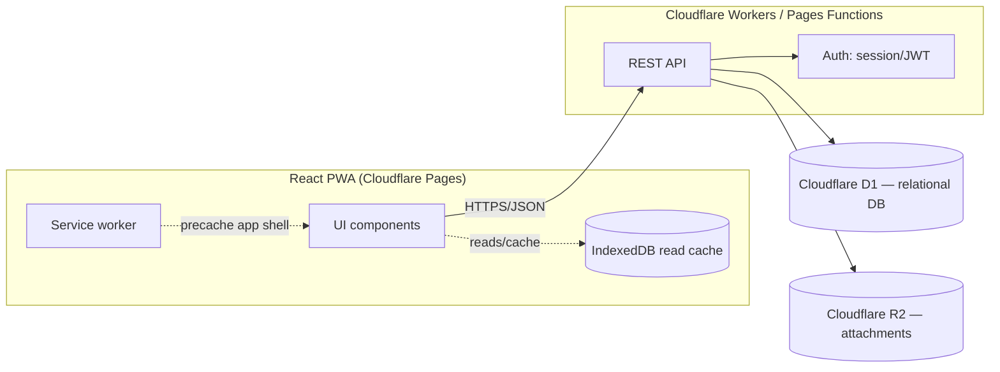
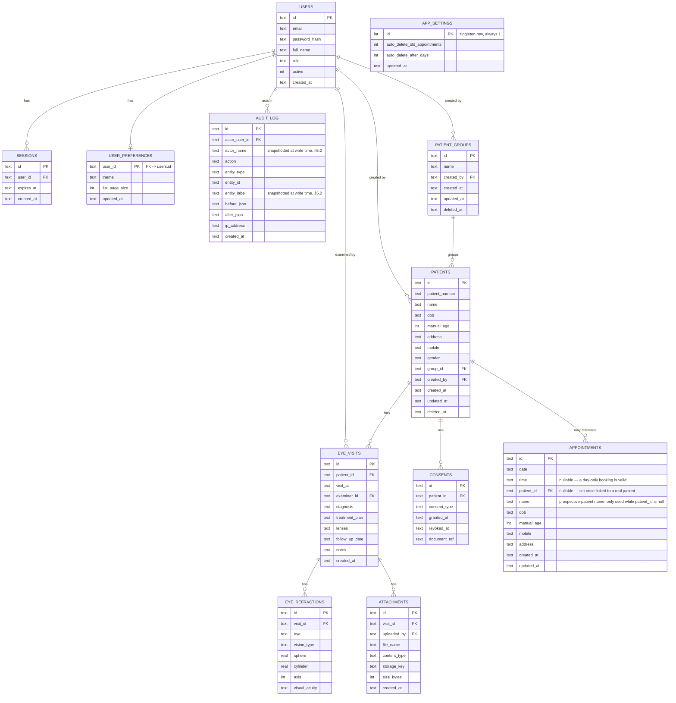

# Ortho and Vision Care — System Design

Status: **draft, for future implementation**. This document specifies the
target architecture and schema for evolving the current client-only MVP into
a multi-user, backend-synced clinical records system. Nothing here is
implemented yet — it is the blueprint the next implementation phases build
against.

## 1. Scope decisions (locked in for this design)

These were confirmed before writing this doc and drive every section below:

| Decision | Choice |
|---|---|
| Data architecture | Backend + database (not local-only) — multi-device sync, durable storage |
| User accounts | Multiple staff accounts with distinct logins, roles, and an audit trail |
| Clinical fields | Per eye, **Distance** and **Reading** prescriptions (sphere, cylinder, axis, visual acuity each), a free-text Lenses line, diagnosis/treatment plan text, attachments (images/scans) — modeled directly on a real prescription pad (see §5.2). Add power was considered but dropped as unneeded (§13) |
| Compliance | Design includes health-data safeguards (encryption, audit logging, retention/export/erasure, consent) from the start |

## 2. Goals / Non-goals

**Goals**
- Durable, centralized storage for patient and clinical data — survives device loss, accessible from multiple staff devices.
- Distinct staff accounts with role-appropriate access (front desk can enter/edit clinical records but never deletes them; deletion is admin-only).
- A complete refraction record per visit — distance and reading prescriptions (sphere, cylinder, axis, visual acuity) per eye, plus lenses, diagnosis/treatment plan, and file attachments.
- An audit trail of who created/changed what, and when.
- A defensible baseline for handling health data: encryption, retention, export, and erasure.
- The existing PWA (install, offline shell) is preserved — this is additive, not a rewrite of the client framework.

**Non-goals (this phase)**
- Real-time collaborative editing (two staff editing the same record simultaneously).
- Billing/insurance, scheduling/appointments, e-prescribing integrations.
- Full offline write support (queued writes while offline, synced later) — Phase 1 targets **online-required writes, offline-cached reads**; true offline writes are called out as a later phase (§9).
- HIPAA/GDPR certification — this document establishes the technical safeguards a compliance program would need, not a legal compliance sign-off.

## 3. Architecture

### 3.1 Current state (recap)

React + Vite PWA, all state in `localStorage`, no backend, no auth. Single
implicit user (whoever has the device). This is what exists in the repo today.

### 3.2 Target architecture



### 3.3 Platform choice

The frontend is already deployed on Cloudflare Pages, so the backend stays in
the same ecosystem to avoid a second platform/bill:

- **API**: Cloudflare Pages Functions (or a Worker) — same deploy pipeline, same account.
- **Database**: Cloudflare D1 (SQLite-compatible, serverless, free tier fits a small clinic's data volume).
- **File storage**: Cloudflare R2 (S3-compatible) for attachments (images/scans).
- **Auth**: server-issued session cookie (httpOnly, `Secure`, `SameSite=Strict`) backed by a `sessions` table — simpler to reason about and revoke than raw JWTs for a low-traffic internal tool.

If data volume or query complexity later outgrows D1, the schema in §5 is
standard relational SQL and ports to Postgres (Neon/Supabase) with minimal
changes (see column-type notes in §5.3).

## 4. User roles & permissions

| Role | Can view demographics | Can create/edit demographics | Can view/create/edit clinical records (visits, refraction, diagnosis) | Can delete clinical records | Can manage attachments (upload/view) | Can manage patient groups (create/rename/delete) | Can book/view appointments | Can manage global app settings | Can manage staff accounts | Can view audit log |
|---|---|---|---|---|---|---|---|---|---|---|
| `admin` | ✅ | ✅ | ✅ | ✅ | ✅ | ✅ | ✅ | ✅ | ✅ | ✅ |
| `doctor` | ✅ | ✅ | ✅ | ❌ | ✅ | ❌ | ✅ | ❌ | ❌ | ❌ |
| `front_desk` | ✅ | ✅ | ✅ | ❌ | ❌ | ❌ | ✅ | ❌ | ❌ | ❌ |

Front desk can register a new patient and edit name/DOB/address/gender —
e.g. at check-in, before a clinician ever opens the chart. Front desk can
also **create and edit** clinical records — a common workflow is
transcribing a doctor's handwritten prescription card into the system —
but cannot **delete** a visit, refraction row, or attachment; deletion of
any clinical record is admin-only, same restriction doctors already have.
The API rejects any `front_desk`-authenticated request touching
`attachments` at all (upload or delete), and rejects any `DELETE` on
`eye_visits`/`eye_refractions` from anyone but `admin` (§6), regardless of
what the client sends.

**Patient groups** (e.g. "Friends", "Family" — a free-form category a
clinic assigns patients to) are **admin-managed, everyone-usable**: only
`admin` can create, rename, or delete a group (via the dedicated screen,
§8.8), but `doctor` and `front_desk` can both *see* the list of groups and
*assign* a patient to one when creating/editing demographics — assigning a
patient to an existing group is part of ordinary demographics editing, not
a separate permission. The API enforces this the same way as everything
else: `POST/PATCH/DELETE /patient-groups` are `admin`-only; `GET
/patient-groups` and the `group_id` field on `POST/PATCH /patients` are
open to any authenticated role (§6).

**Appointments** (§8.11) reuse the exact same create-patient/create-visit
permissions every role already has — there's no separate "can book
appointments" grant to reason about. Booking, viewing, editing, deleting,
"add as patient," and "add visit" are all open to every role — unlike
clinical records, appointment deletion is **not** admin-only; any of the
three roles can delete any appointment, since a booking mistake made by
front desk shouldn't require an admin to come fix it. The *how* differs by
role purely as a UI convenience, not a permission: `doctor`/`front_desk`
get a per-row delete icon, `admin` gets bulk select-all + delete-selected
instead of the per-row icon (§8.11) — same underlying `DELETE
/appointments/:id` (§6) either way. The one appointments-related thing
that *is* admin-only is the **global auto-delete setting** (§5.2, §8.10,
§8.11) — a `doctor` or `front_desk`
session gets `403` from `GET`/`PATCH /settings` (§6), same enforcement
pattern as everything else in this table.

Permissions are enforced **server-side** on every API call — the role in the
session determines what the API returns/accepts, never trust the client.
Modeled as a `role` enum on the user for now (§5); if permission needs get
more granular later (e.g. per-patient access lists), split into `roles` +
`permissions` + join tables without changing the rest of the schema.

## 5. Data model

### 5.1 Entity overview



### 5.2 Field notes / definitions

- **`patient_groups` / `patients.group_id`** — a free-form category a clinic
  puts patients into (e.g. "Friends", "Family", "VIP"), not a clinical
  concept. Modeled as **one group per patient** (`patients.group_id` is a
  single nullable FK, not a join table) — matches the examples given
  (mutually-exclusive categories, not overlapping tags). If overlapping
  multi-group membership turns out to be needed later, that's an additive
  `patient_group_members` join table without touching anything else here
  (flagged as an open question, §13).
  - `patient_groups.name` is `UNIQUE NOT NULL`.
  - Soft-deleted the same way as `patients` (`deleted_at`) rather than hard
    deleted — so a patient's historical group assignment still resolves to
    a name even after a group is retired, but retired groups drop out of
    the assignable/filterable list (§6, §8.8).
  - Mutation (`POST`/`PATCH`/`DELETE /patient-groups`) is **admin-only**;
    reading the list and setting `patients.group_id` is open to any role
    that can edit demographics — i.e. all three roles (§4).
- **`patients.patient_number`** — the human-facing patient ID (distinct from
  `patients.id`, which stays an opaque UUID used only internally for foreign
  keys). Format: **`P-YYYYMMDD-NNNN`** — registration date + a 4-digit
  sequence that resets daily (e.g. `P-20260705-0007` = the 7th patient
  registered on 2026-07-05). This is what's shown in the UI, printed on a
  physical file/label, and read aloud over the phone — not the UUID.
  - **Monotonically increasing**: because the date prefix always increases
    and the sequence is zero-padded to a fixed width, sorting
    `patient_number` as plain text always matches registration order —
    no need to parse it or join to `created_at` to get chronological order.
  - **Generation**: assigned once at creation, immutable after. Computed
    atomically via a small counters table (`patient_number_counters`, §5.3)
    keyed by date, incremented with a single `UPDATE ... RETURNING` inside
    the same transaction as the `INSERT INTO patients`, so two concurrent
    registrations on the same day never collide — no read-then-write race.
  - **Capacity**: 4 digits supports 9,999 new registrations/day, far beyond
    a small clinic's volume (§11); widen to 5+ digits if that changes.
  - `UNIQUE NOT NULL` — enforced at the DB level as a backstop even though
    generation is already collision-free by construction.
  - **Search**: `GET /patients?search=` (§6) matches name or `patient_number`
    in one query:
    ```sql
    SELECT id, patient_number, name, dob, manual_age, gender
    FROM patients
    WHERE deleted_at IS NULL
      AND (name LIKE '%' || :q || '%' COLLATE NOCASE
           OR patient_number LIKE '%' || :q || '%')
    ORDER BY created_at DESC;
    ```
    A leading-wildcard `LIKE` can't use the `patient_number`/`name` indexes,
    but at clinic scale (§11: hundreds–low thousands of rows) a full scan is
    still sub-millisecond — no need for FTS5 or trigram indexing yet.
  - **Minimum query length: 3 characters.** A 1–2 character query against a
    leading-wildcard `LIKE` on `name` matches a large fraction of any real
    patient list (e.g. `"an"` matches every "*an*"), which is neither a
    useful result nor a cheap query at scale. The API rejects
    `search` values shorter than 3 characters with `400 Bad Request`; the
    client never sends one in the first place (§7).
- **Age**: never stored as a derived value. If `patients.dob` is set, age is
  computed at read time (same logic as today's `computeAgeFromDob`) —
  *unless* `manual_age` is also set, in which case it takes precedence: the
  patient form lets staff type over the dob-computed age (correcting an
  imprecise dob, say), and that override should stick rather than being
  silently discarded just because a dob exists. `manual_age` is only ever
  persisted alongside a `dob` when it's a genuine override (the value the
  staff member actually typed differs from what the dob computes to); if it
  matches, the form clears it so the age keeps recomputing — and so stays
  correct as birthdays pass — instead of freezing at whatever it was when
  last saved. Picking a new `dob` always recomputes the age and discards any
  earlier override. If `dob` is null, `manual_age` is the only age there is.
  This precedence (`manual_age` wins when present, else `dob`) is enforced
  in application logic, not a DB constraint (SQLite has no
  partial-exclusion constraints worth the complexity here).
- **Refraction shape — modeled directly on a real prescription pad**: a
  physical prescription (see below) has two *rows* per eye, not one —
  **Distance** vision and **Reading** (near) vision — each with its own
  Sphere, Cylinder, Axis, and Visual Acuity. `eye_refractions` captures this
  as one row per `(eye, vision_type)` pair, so a single visit produces up to
  four rows: left/distance, left/reading, right/distance, right/reading.

  ```
                    RIGHT EYE                          LEFT EYE
              D.Sph   D.Cyl   Axis   V.A         D.Sph   D.Cyl   Axis   V.A
  Distance     ...     -0.25   110°   6/6         -0.25   -0.25   40°    6/6
  Reading     Add +1.5  ...    ...    N/6          ...     ...    ...    N/6
  ```

  (This is the real card's own layout, reproduced for context — our schema
  does *not* model the "Add" value it shows; see below.)

  This replaces the earlier single ambiguous "distance" field from the first
  draft of this document — resolving Open Question #1 below.
- **`eye` enum**: `'left' | 'right'`.
- **`vision_type` enum**: `'distance' | 'reading'` — which row of the
  prescription this is.
- **Sphere / cylinder**: signed decimals, diopters (e.g. `-0.25`, `+2.00`).
  Nullable — a reading row can be left entirely blank if a clinic doesn't
  compute a separate near prescription for a given patient.
  Stored as `REAL` (D1/SQLite) — see §5.3 for Postgres equivalent (`NUMERIC(5,2)`).
- **Axis**: integer 0–180 (degrees). Not signed — enforce range in application
  validation (`CHECK` constraint optionally added in D1/SQLite 3.37+).
- **No `add_power` field.** The near-vision "Add" value on the physical card
  was considered and deliberately dropped — not needed for this clinic's
  records (§13). Sphere/cylinder/axis/VA are captured per row regardless of
  vision type; a reading prescription is entered as its own absolute values,
  not as a delta on top of distance.
- **`visual_acuity`**: free text (e.g. `"6/6"` for distance, `"N/6"` for
  reading) rather than a fixed enum — acuity notations vary by clinic/chart
  (Snellen feet, Snellen metric, Snellen near-point) and forcing a single
  format would lose information from the source chart.
- **`eye_visits.lenses`**: free-text line (e.g. "progressive", "bifocal",
  "single vision, anti-glare") — matches the "Lenses …" line on the
  prescription pad; one per visit, not per eye.
- **`manual_age`**: nullable integer. Meaningful whenever it's set — either
  because there's no `dob` at all, or because it's a deliberate override of
  the `dob`-computed age (§ Age above).
- **`patients.mobile`**: nullable, 10-digit India mobile number (no country
  code stored — always `+91` in this clinic's context). Validated client-side
  (`[6-9][0-9]{9}` — Indian mobile numbers never start with 0–5) but stored
  as plain text, not normalized/formatted, since a clinic may still want to
  paste in a number with spaces or a leading `0`/`+91` from a handwritten
  form; the API doesn't reject on format, only the client nudges towards it.
- **Soft delete**: `patients.deleted_at` — patient rows are never hard-deleted
  by normal staff action (needed for audit trail integrity); hard delete is a
  separate admin-triggered erasure workflow (§10).
- **`audit_log.before_json` / `after_json`**: snapshot of the changed row
  (JSON-encoded), not full-table diffs — enough to reconstruct history without
  a general-purpose event-sourcing system. `before_json` is unset for
  `create`; `after_json` is unset for `delete`.
- **`audit_log.actor_name` / `entity_label`**: snapshotted at write time
  rather than resolved later via a join to `users`/the entity's own table —
  the list view (§8.9) needs a human-readable actor and record reference
  for *every* row without a live lookup that can fail once the referenced
  row is gone. This matters even for tables that soft-delete (`patients`,
  `patient_groups` keep their row via `deleted_at`, so a join would still
  resolve) because `eye_visits` and `appointments` are **hard**-deleted —
  there the row is genuinely gone, and a live join can never recover its
  name. Snapshotting both strings once, at the moment of the action, works
  identically for every entity type regardless of that table's delete
  semantics.
- **`user_preferences`**: one row per user, holding personal (not clinical)
  settings — device-independent, since the same account may be used from
  more than one device/browser. One-to-zero-or-one with `users` (a user who
  has never opened Preferences simply has no row; reads fall back to
  `theme='auto'`/`list_page_size=NULL` in application code rather than the
  API needing to pre-populate a row per new user).
  - **`theme`**: `'light' | 'dark' | 'auto'`. `'auto'` follows the browser's
    `prefers-color-scheme` media query (light/dark based on the OS/browser
    setting) exactly like the client already does today with no preference
    system at all — `'light'`/`'dark'` force that scheme regardless of the
    OS setting.
  - **`list_page_size`**: nullable integer — items per page in list views
    (patient list, visit history, ...) app-wide. `NULL` means "use the
    client's own built-in default (20)" rather than the API/DB asserting an
    opinion about what that default should be; the client is the single
    source of truth for the fallback value (§7).
- **`appointments`**: a booked day/time slot, for either an existing patient
  (`patient_id` set) or a not-yet-registered one (`patient_id` null, and
  `name`/`dob`/`manual_age`/`mobile`/`address` capture what front desk took
  down over the phone/at the counter, §8.11).
  - **Existing vs. prospective is a discriminant on `patient_id`**, not a
    separate `status`/`type` column — `patient_id IS NULL` *is* "this is a
    prospective patient," and the moment `PATCH /appointments/:id` sets it
    (because "Add patient" ran, §8.11), the row behaves as an
    existing-patient appointment from then on; `name`/`dob`/etc. are left in
    place as a historical record but no longer read for display (the linked
    patient's own name/DOB take over).
  - **No `status` column at all in this phase** — there's no
    booked/completed/cancelled workflow, and converting an appointment (to a
    patient, or to a visit) doesn't remove or alter it beyond linking
    `patient_id`. The only thing that ever removes a row is the auto-delete
    sweep below. A cancel/complete workflow is a plausible future addition
    (§13) that would add a `status` column without touching anything else
    here.
  - **`date`/`time` are separate columns** (`YYYY-MM-DD` / `HH:MM`), not one
    combined datetime — matches how the booking form collects them (§8.11)
    and how filtering by date/date-range (`?from=&to=`, §6) reads most
    naturally as a plain string-range comparison on `date` alone.
  - **`date` is the only required field besides the patient** — `time` is
    nullable; a day-only booking (no specific slot yet) is valid. Sorting
    (`?sort=` default, §6) treats a null `time` as sorting after every timed
    appointment on the same `date`, not before.
  - **Auto-delete sweep**: whenever `app_settings.auto_delete_old_appointments`
    is true, any appointment whose `date` is more than
    `app_settings.auto_delete_after_days` in the past is deleted. In this
    client-only build the sweep runs whenever the app loads or an admin
    changes either setting (no background scheduler); the real backend
    equivalent (§9) is a periodic job (e.g. a daily cron) running the same
    `DELETE FROM appointments WHERE date < :cutoff` rather than a per-request
    check, since staleness only matters at day granularity.
- **`app_settings`**: a **singleton row** (`id` always `1`, enforced by
  `CHECK (id = 1)`, §5.3) holding app-wide, admin-configurable settings —
  today just the two auto-delete fields above. Deliberately *not* rows in
  `user_preferences`: these apply to the whole clinic/instance regardless of
  which admin changes them, not to one person's own account (§8.10, §8.11).
  `GET`/`PATCH /settings` (§6) are `admin`-only; every other role never sees
  this resource at all.
- **Timestamps & default sort order**: every record-bearing table carries a
  proper datetime, and every list view has a defined default sort — never
  incidental insertion order:
  - `patients.created_at` — when the patient was registered. Patient lists
    default to **newest-registered-first** (`created_at DESC`), backed by
    `idx_patients_created_at`.
  - `eye_visits.visit_at` — a full **date + time** of the exam (not just a
    date), distinct from `eye_visits.created_at` (when the row was entered
    into the system, which may be later — e.g. front desk transcribing a
    paper chart the next day). Visit history defaults to
    **most-recent-visit-first** (`visit_at DESC`), backed by
    `idx_visits_patient`. Using a full timestamp (rather than a date) means
    two same-day visits sort deterministically by time, not by insertion
    order.
  - This is a formal contract of the API (§6), not just a UI convenience —
    the server guarantees the order, so the client never needs its own
    sort-by-date logic to get a correct default view.

### 5.3 Schema (Cloudflare D1 / SQLite dialect)

```sql
PRAGMA foreign_keys = ON;

CREATE TABLE users (
    id            TEXT PRIMARY KEY,             -- uuid, generated by application
    email         TEXT NOT NULL UNIQUE,
    password_hash TEXT NOT NULL,                -- argon2id/bcrypt hash, never plaintext
    full_name     TEXT NOT NULL,
    role          TEXT NOT NULL CHECK (role IN ('admin', 'doctor', 'front_desk')),
    active        INTEGER NOT NULL DEFAULT 1,   -- boolean
    created_at    TEXT NOT NULL DEFAULT (datetime('now')),
    last_login_at TEXT
);

CREATE TABLE sessions (
    id         TEXT PRIMARY KEY,                -- opaque random token, hashed before storage
    user_id    TEXT NOT NULL REFERENCES users(id) ON DELETE CASCADE,
    expires_at TEXT NOT NULL,
    created_at TEXT NOT NULL DEFAULT (datetime('now'))
);
CREATE INDEX idx_sessions_user ON sessions(user_id);

-- Backs atomic generation of patients.patient_number (one row per calendar day).
CREATE TABLE patient_number_counters (
    date_key TEXT PRIMARY KEY,                  -- 'YYYYMMDD'
    next_seq INTEGER NOT NULL DEFAULT 1
);

-- Admin-managed categories (e.g. "Friends", "Family"); one per patient (§5.2).
CREATE TABLE patient_groups (
    id         TEXT PRIMARY KEY,
    name       TEXT NOT NULL UNIQUE,
    created_by TEXT REFERENCES users(id),
    created_at TEXT NOT NULL DEFAULT (datetime('now')),
    updated_at TEXT NOT NULL DEFAULT (datetime('now')),
    deleted_at TEXT                              -- soft delete; null = active
);
CREATE INDEX idx_patient_groups_name ON patient_groups(name);

CREATE TABLE patients (
    id             TEXT PRIMARY KEY,             -- opaque UUID; internal FK target only
    patient_number TEXT NOT NULL UNIQUE,         -- e.g. "P-20260705-0007"; human-facing ID (§5.2)
    name           TEXT NOT NULL,
    dob            TEXT,                         -- ISO date (YYYY-MM-DD); null if unknown
    manual_age     INTEGER,                      -- null unless there's no dob, or it's a deliberate override of the dob-computed age
    address        TEXT,
    mobile         TEXT,                         -- 10-digit India mobile number, validated client-side (§5.2)
    gender         TEXT NOT NULL CHECK (gender IN ('female', 'male', 'other', 'unspecified')),
    group_id       TEXT REFERENCES patient_groups(id),  -- nullable; ungrouped by default
    created_by     TEXT REFERENCES users(id),
    created_at     TEXT NOT NULL DEFAULT (datetime('now')),
    updated_at     TEXT NOT NULL DEFAULT (datetime('now')),
    deleted_at     TEXT                          -- soft delete; null = active
);
CREATE INDEX idx_patients_name ON patients(name);
CREATE INDEX idx_patients_deleted_at ON patients(deleted_at);
CREATE INDEX idx_patients_created_at ON patients(created_at DESC);  -- supports default sort (§6)
CREATE INDEX idx_patients_group ON patients(group_id);              -- supports filter by group (§6)

CREATE TABLE eye_visits (
    id             TEXT PRIMARY KEY,
    patient_id     TEXT NOT NULL REFERENCES patients(id) ON DELETE CASCADE,
    visit_at       TEXT NOT NULL,               -- ISO-8601 datetime (date + time) of the exam
    examiner_id    TEXT REFERENCES users(id),
    diagnosis      TEXT,
    treatment_plan TEXT,
    lenses         TEXT,                        -- free text, e.g. "progressive", "bifocal"
    follow_up_date TEXT,
    notes          TEXT,
    created_at     TEXT NOT NULL DEFAULT (datetime('now')),
    updated_at     TEXT NOT NULL DEFAULT (datetime('now'))
);
CREATE INDEX idx_visits_patient ON eye_visits(patient_id, visit_at DESC);

-- One row per (eye, vision_type): up to 4 rows per visit
-- (left/distance, left/reading, right/distance, right/reading),
-- mirroring a standard Distance/Reading x Right/Left prescription pad.
CREATE TABLE eye_refractions (
    id            TEXT PRIMARY KEY,
    visit_id      TEXT NOT NULL REFERENCES eye_visits(id) ON DELETE CASCADE,
    eye           TEXT NOT NULL CHECK (eye IN ('left', 'right')),
    vision_type   TEXT NOT NULL CHECK (vision_type IN ('distance', 'reading')),
    sphere        REAL,
    cylinder      REAL,
    axis          INTEGER CHECK (axis IS NULL OR (axis >= 0 AND axis <= 180)),
    visual_acuity TEXT,                         -- e.g. "6/6", "N/6" — free text, chart-dependent notation
    UNIQUE (visit_id, eye, vision_type)
);
CREATE INDEX idx_refractions_visit ON eye_refractions(visit_id);

CREATE TABLE attachments (
    id           TEXT PRIMARY KEY,
    visit_id     TEXT NOT NULL REFERENCES eye_visits(id) ON DELETE CASCADE,
    uploaded_by  TEXT REFERENCES users(id),
    file_name    TEXT NOT NULL,
    content_type TEXT NOT NULL,
    storage_key  TEXT NOT NULL,                 -- R2 object key
    size_bytes   INTEGER NOT NULL,
    created_at   TEXT NOT NULL DEFAULT (datetime('now'))
);
CREATE INDEX idx_attachments_visit ON attachments(visit_id);

CREATE TABLE consents (
    id            TEXT PRIMARY KEY,
    patient_id    TEXT NOT NULL REFERENCES patients(id) ON DELETE CASCADE,
    consent_type  TEXT NOT NULL,                -- e.g. "treatment", "data_processing"
    granted_at    TEXT NOT NULL DEFAULT (datetime('now')),
    revoked_at    TEXT,
    document_ref  TEXT                          -- R2 key for a signed consent form, if any
);
CREATE INDEX idx_consents_patient ON consents(patient_id);

CREATE TABLE audit_log (
    id             TEXT PRIMARY KEY,
    actor_user_id  TEXT REFERENCES users(id),
    actor_name     TEXT NOT NULL,               -- snapshotted at write time (§5.2)
    action         TEXT NOT NULL CHECK (action IN ('create', 'update', 'delete', 'export')),
    entity_type    TEXT NOT NULL,               -- 'patient' | 'patient_group' | 'eye_visit' | 'appointment' | 'attachment' | ...
    entity_id      TEXT NOT NULL,
    entity_label   TEXT NOT NULL,               -- snapshotted at write time (§5.2) — e.g. a patient's name
    before_json    TEXT,
    after_json     TEXT,
    ip_address     TEXT,
    created_at     TEXT NOT NULL DEFAULT (datetime('now'))
);
CREATE INDEX idx_audit_entity ON audit_log(entity_type, entity_id);
CREATE INDEX idx_audit_actor ON audit_log(actor_user_id, created_at);

-- One row per user, created lazily on first write (not on user creation).
CREATE TABLE user_preferences (
    user_id        TEXT PRIMARY KEY REFERENCES users(id) ON DELETE CASCADE,
    theme          TEXT NOT NULL DEFAULT 'auto' CHECK (theme IN ('light', 'dark', 'auto')),
    list_page_size INTEGER,                     -- null = use the client's own default (20, §7)
    updated_at     TEXT NOT NULL DEFAULT (datetime('now'))
);

CREATE TABLE appointments (
    id          TEXT PRIMARY KEY,
    date        TEXT NOT NULL,                  -- ISO date (YYYY-MM-DD)
    time        TEXT,                           -- HH:MM, 24h; null = day-only booking (§5.2)
    patient_id  TEXT REFERENCES patients(id) ON DELETE SET NULL,  -- null = prospective patient (§5.2)
    name        TEXT,                           -- prospective-patient name; only meaningful while patient_id is null
    dob         TEXT,
    manual_age  INTEGER,
    mobile      TEXT,
    address     TEXT,
    created_at  TEXT NOT NULL DEFAULT (datetime('now')),
    updated_at  TEXT NOT NULL DEFAULT (datetime('now'))
);
CREATE INDEX idx_appointments_date ON appointments(date, time);  -- supports default sort + date-range filter (§6)

-- Singleton row (§5.2) — app-wide settings, not per-user.
CREATE TABLE app_settings (
    id                            INTEGER PRIMARY KEY CHECK (id = 1),
    auto_delete_old_appointments  INTEGER NOT NULL DEFAULT 1,
    auto_delete_after_days        INTEGER NOT NULL DEFAULT 2,
    updated_at                    TEXT NOT NULL DEFAULT (datetime('now'))
);
```

**Porting to Postgres later**: `TEXT` timestamp/date columns → `TIMESTAMPTZ`/`DATE`;
`TEXT` id columns → native `UUID` with `gen_random_uuid()`; `REAL` → `NUMERIC(5,2)`;
`INTEGER` booleans → native `BOOLEAN`; `CHECK (... IN (...))` → native `ENUM` types.

**Generating `patient_number` (example)** — run inside the same transaction
as the `INSERT INTO patients`:

```sql
INSERT INTO patient_number_counters (date_key, next_seq)
VALUES (:date_key, 2)
ON CONFLICT (date_key) DO UPDATE SET next_seq = next_seq + 1
RETURNING next_seq - 1 AS seq;
-- :date_key = strftime('%Y%m%d', 'now'); patient_number = 'P-' || :date_key || '-' || printf('%04d', seq)
```

This is a single atomic upsert-and-return — two concurrent registrations on
the same day each get a distinct `seq` with no read-then-write gap to race on.

**On Postgres**, the equivalent is a `SEQUENCE` per day (or a single
`BIGSERIAL` with the date formatted separately) — either works; the emphasis
here is "atomic increment, not read-max-then-add-one", which both engines
support.

## 6. API surface (v1)

All endpoints under `/api`, JSON in/out, session cookie required except `/auth/login`.
Every mutating endpoint writes an `audit_log` row server-side. Every endpoint
that returns a list has a fixed **default sort order** (noted per row below);
callers can override with an explicit `?sort=` param later if ever needed,
but the unsorted default is never "whatever order the DB happened to return."

Every list endpoint that can grow unbounded (patients, visits, audit log,
staff accounts) is paginated with `page` (0-indexed, default `0`) and
`limit` (default `50`, matching the client's `ListView` page size; max TBD)
query params, and returns
`{ items: [...], totalCount: number }` rather than a bare array —
`totalCount` is the count across *all* pages, not just the returned page,
so the client can render "N things" and compute total page count without
an extra request. (`GET /patient-groups` is deliberately excluded — it's a
small, admin-managed selector list, not something expected to need
paging.) This is a deliberate, load-bearing contract: the client's
`ListView` component already has a server-paged mode built around exactly
this shape (`items` = current page, `totalCount` = grand total, `page`/
`onPageChange` round-tripped to the API) so that swapping a hook's
internals from `localStorage` to `fetch` doesn't require changing the list
UI at all — only the data-fetching layer.

| Method & path | Role required | Purpose | Default sort |
|---|---|---|---|
| `POST /auth/login` | — | Authenticate, set session cookie | — |
| `POST /auth/logout` | any | Invalidate session | — |
| `GET /auth/me` | any | Current user + role | — |
| `GET /me/preferences` | any | Current user's own theme + list page size (§5.2). Not gated by role — every account manages its own | — |
| `PATCH /me/preferences` | any | Update either/both fields; creates the row on first write if it doesn't exist yet | — |
| `GET /users?page=&limit=` | admin | List staff accounts | `full_name` asc |
| `POST /users` | admin | Create staff account | — |
| `PATCH /users/:id` | admin | Update role/active status | — |
| `GET /patients?search=&group_id=&sort=&page=&limit=` | any | List/search patients. `search` matches **name** (substring, case-insensitive) **or** `patient_number` (substring, so a partial number or date prefix like `P-20260705` also works) — ≥3 characters or omitted, shorter values → `400` (§5.2). Optional `group_id` filters to one group. Optional `sort` overrides the default: `group` (group name asc, then `created_at` desc within a group), `name_asc`/`name_desc` (patient name, case-insensitive) — omit for the plain default below. Summary rows only (`patient_number`/name/age/gender/group); full clinical detail lives on the visit endpoints below | `created_at` **desc** (newest-registered first) |
| `POST /patients` | admin, doctor, front_desk | Create patient (demographics only, optionally including `group_id` — request body may not include clinical fields). Response includes the generated `patient_number` | — |
| `GET /patients/:id` | any | Patient detail (demographics, including group; visit history fetched separately via `/patients/:id/visits`) | — |
| `GET /patients/by-number/:patient_number` | any | **Exact-match** convenience alias for the common case of already having the full ID (e.g. a barcode/QR scan) — skips the substring search. Resolves to the same detail response as `GET /patients/:id` | — |
| `PATCH /patients/:id` | admin, doctor, front_desk | Update demographics, including reassigning `group_id` (any role that can edit demographics — not restricted to admin, §4) | — |
| `DELETE /patients/:id` | admin | Soft-delete patient (+ cascade note in audit log) | — |
| `GET /patient-groups` | any | List active (non-deleted) patient groups, for the group selector in patient forms and the filter dropdown | `name` asc |
| `POST /patient-groups` | admin | Create a group | — |
| `PATCH /patient-groups/:id` | admin | Rename a group | — |
| `DELETE /patient-groups/:id` | admin | Soft-delete a group (existing patients keep their `group_id`/name for history; the group drops out of future assignment/filter lists) | — |
| `GET /patients/:id/visits?page=&limit=` | admin, doctor, front_desk | Visit history for a patient | `visit_at` **desc** (most recent visit first) |
| `POST /patients/:id/visits` | admin, doctor, front_desk | Create a visit — one payload containing a `visit_at` datetime, up to 4 refraction rows (distance/reading × left/right), diagnosis, treatment plan, and lenses | — |
| `GET /visits/:id` | admin, doctor, front_desk | Single visit detail | — |
| `PATCH /visits/:id` | admin, doctor, front_desk | Update a visit | — |
| `DELETE /visits/:id` | admin | Delete a visit | — |
| `POST /visits/:id/attachments` | admin, doctor | Upload a file (multipart → R2) | — |
| `GET /attachments/:id` | admin, doctor | Fetch (redirect to a short-lived signed R2 URL) | — |
| `DELETE /attachments/:id` | admin | Remove attachment | — |
| `GET /patients/:id/export` | admin | Full patient data export (JSON/PDF) — data portability | — |
| `GET /audit-log?search=&entity_type=&actor_user_id=&from=&to=&page=&limit=` | admin | Audit trail lookup (§8.9). `search` matches `actor_name` or `entity_label` (≥3 chars, same rule as `/patients`, §5.2). `entity_type`/`actor_user_id` filter to one value each; `from`/`to` filter to a date range (either or both, inclusive) | `created_at` **desc** (most recent activity first, not user-configurable) |
| `GET /appointments?search=&from=&to=&sort=&page=&limit=` | any | List/search appointments (§8.11). `search` matches the resolved patient name (linked patient's name, or the prospective `name` — ≥3 chars, same rule as `/patients`, §5.2). `from`/`to` filter to a date range (either or both, inclusive). `sort` overrides the default: `name_asc`/`name_desc` | `date`, `time` asc (soonest first) |
| `POST /appointments` | any | Book an appointment — either `patient_id` (existing patient) or `name`/`dob`/`manual_age`/`mobile`/`address` (prospective patient), plus `date` (required) and `time` (optional). `date` must be today or later — rejects a past date with `400` (§8.11) | — |
| `PATCH /appointments/:id` | any | Update any of `date`/`time`/`patient_id`/`name`/`dob`/`manual_age`/`mobile`/`address` — used both for the Edit action (§8.11) and to set `patient_id` once a prospective patient is registered via "Add patient" | — |
| `DELETE /appointments/:id` | any | Delete a single appointment (§8.11) — not admin-only, unlike `DELETE /visits/:id`; the client's "bulk delete" is just this endpoint called once per selected id | — |
| `GET /settings` | admin | App-wide settings (auto-delete toggle + day threshold, §5.2) | — |
| `PATCH /settings` | admin | Update either/both fields | — |

## 7. Client changes (high level)

- Replace direct `localStorage` reads/writes in `usePatients`/`useEyeRecords`
  with calls to the API, backed by an IndexedDB cache for offline reads
  (e.g. via a small wrapper or a library like `idb`).
- Add a login screen + auth context; role gates which UI controls render —
  front desk sees and can edit the same refraction/diagnosis forms as a
  doctor, but the delete button on a visit/refraction/attachment is hidden
  (not just disabled) for anyone but `admin`. Attachment upload/view is
  hidden entirely for `front_desk`.
- Rework `EyeRecordForm`/`EyeRecordHistory` around the Distance/Reading ×
  Left/Right grid (§5.2) instead of the current single sphere/cylinder/
  distance-per-eye fields — plus diagnosis/treatment plan, lenses, and
  attachment upload/preview.
- **Attachment upload is implemented** in this local-storage build, not just
  reserved schema/API — a new `useAttachments` hook (same shape as every
  other data hook here: load-or-seed then persist on change, called once in
  `App` and threaded down as props) backs multi-photo upload directly in
  `EyeRecordForm` and thumbnail display in `EyeRecordHistory`.
  - **Client-side compression before storage**: `browser-image-compression`
    downscales (longest side capped ~1800px) and re-encodes as JPEG at a
    moderate quality *before* anything is persisted — a raw phone photo
    goes from several MB down to a few hundred KB, which matters a lot
    given the storage constraint below. Runs in a Web Worker so it doesn't
    block the UI on a large photo.
  - **Stored as a data URL, not an R2 `storage_key`**: this local-only build
    has no object storage, so the compressed image is kept directly on the
    `Attachment` record. This is a genuine limitation, not just a
    placeholder — `localStorage`'s ~5–10MB origin quota means this doesn't
    scale past a modest number of compressed photos; the real backend's R2
    upload (§6) is what actually removes that ceiling, not a client change.
  - **Viewed in an in-page overlay (`ImageViewer`), not a new tab**: modern
    browsers block top-level navigation to a `data:` URL from a click
    (`<a href target="_blank">` silently does nothing), so tapping a
    thumbnail opens a full-screen preview within the page instead — this is
    the only option that works given the data-URL storage above, and it's
    what the real backend's short-lived signed R2 URL (`GET
    /attachments/:id`, §6) would replace it with once that exists.
  - **Delete is admin-only**; upload and view are open to `admin`/`doctor`
    and hidden entirely for `front_desk` (§8.4/§8.5) — same split as every
    other clinical-record permission (§4). Removing a *not-yet-saved*
    pending photo (before the visit is even submitted) isn't gated by this,
    since nothing has been persisted yet to delete.
  - **Cascade delete**: removing a visit or a patient also removes that
    visit's (or all of the patient's visits') attachments, logging one
    audit entry per removed attachment — mirrors how visit deletion already
    cascades from patient deletion.
  - Every create/delete is written to the audit log (§8.9) the same way
    every other mutation hook already does, with a metadata-only snapshot
    (file name, content type, size, visit id) — never the data URL itself,
    which would otherwise bloat every log entry with the full image.
  - **A photo counts as content**: a visit with a prescription photo but no
    clinical fields filled in is still a real record worth saving, so both
    `EyeRecordForm`'s own disable check and `useEyeVisits`'s
    `addVisit`/`updateVisit` guard (which independently re-checks
    `isEmptyVisit`, since it's the source of truth even if a caller's UI
    check were ever bypassed) now treat existing or pending attachments as
    non-empty content, not just refractions/text fields.
  - **`ImageViewer` supports multiple images**: it takes an image list and a
    starting index rather than a single image, so a visit with several
    photos (or the form's existing-plus-pending set while still editing)
    can be scrolled through — a scroll-snap strip for native touch/wheel
    scrolling, prev/next buttons and arrow-key navigation that stay in sync
    with whatever was scrolled to, and an "n / total" counter.
    - The scroll-snap track fills almost the entire dialog, so tapping it
      (image or backdrop within it) closes the viewer the same as tapping
      the padded edge does — it doesn't swallow the click, since doing so
      would leave next to no "outside" area left to tap. The prev/next/close
      buttons stop their own click's propagation so they don't also trigger
      this.
    - The track only scrolls horizontally, so a vertical swipe over it has
      nowhere to go and — without an explicit lock — chains through to
      whatever's scrollable behind the viewer (the patient list/history
      underneath). The viewer locks `document.body`'s scroll for as long as
      it's mounted and restores it on close.
- **`PatientForm`'s Age field is never disabled**, even when a DOB is set —
  it's prefilled with the DOB-computed age but staff can type over it. The
  field only recomputes (discarding whatever was typed) when the DOB itself
  changes to a new value; picking the same DOB again wouldn't touch it,
  since `onChange` only fires on an actual change. On submit, the typed
  value is only sent as `manualAge` if it actually diverges from the
  DOB-computed one at that moment — an untouched or since-reset field is
  sent as `undefined` instead, so the age keeps recomputing (and staying
  correct as birthdays pass) rather than freezing at whatever it was when
  last saved (§5.3). The label reflects which state it's in: "(from DOB)"
  or "(overridden)".
- The visit form captures `visit_at` as a date **and** time (not just a
  date picker) — default it to "now" on create, but let staff adjust it
  (e.g. entering a visit that happened earlier and is only now being typed
  up).
- Patient list and visit history render in whatever order the API returns
  (§6) — the client does not re-sort client-side. This keeps "sorted by date
  by default" a server-guaranteed property rather than something that can
  drift if a client is added/changed later.
- `patient_number` is shown wherever a patient is identified — patient list
  row, patient detail header. There is **one search box** in the patient
  list, backed by `GET /patients?search=`, which matches name or
  `patient_number` — staff don't need to pick "search by name" vs "search by
  ID" as separate modes, they just type either one.
- The search box debounces input and only calls the API once the query is
  **3+ characters**; below that it shows the unfiltered (or previous) list
  rather than firing a request, matching the API's enforced minimum (§5.2).
- A new admin-only Manage Groups screen (§8.8), plus a group filter/sort
  control and a group selector added to the existing patient list and
  patient form.
- Lists render through a shared `ListView` component with two modes: today
  (local-storage) it's handed the entire filtered array and pages through
  it client-side; once a screen's data comes from the real API it's handed
  only the current page's `items` plus the API's `totalCount`, and owns the
  `page` number itself, re-fetching on `onPageChange` (§6's
  `page`/`limit`/`totalCount` contract exists specifically so this swap
  doesn't require changing `ListView` or any screen's markup — only the
  data-fetching hook underneath it).
- The patient list's search/group-filter/sort state (plus a "reset filters"
  action) is likewise isolated behind one hook (`usePatientQuery`) rather
  than lived directly in the screen component. Today its body is an
  in-memory filter/sort over the full `patients` array; once the backend
  exists it becomes a debounced call to `GET /patients?search=&group_id=&
  sort=&page=&limit=` (§6) instead — the hook's returned shape (search/
  setSearch/groupId/setGroupId/sort/setSort/resetFilters/isFilterActive/
  results) stays the same either way, so `PatientList` and `SearchBox`
  don't change when that swap happens.
- Per-user preferences (theme; list page size) are likewise isolated behind
  `usePreferences`, backed by a `PreferencesProvider` context (mirroring
  `AuthProvider`) rather than a plain hook — every consumer (the theme
  effect, `PreferencesScreen`, `PatientList`, `EyeRecordHistory`) needs to
  see the *same* current value, which a plain per-call `useState` hook
  can't give them. Today it reads/writes a `localStorage` map keyed by
  user id; once the backend exists it becomes `GET`/`PATCH /me/preferences`
  (§6) instead, with the same returned shape (`preferences`,
  `updatePreferences`) so none of those consumers change. `ListView`'s own
  `pageSize` default (20) is only ever a *fallback* — a caller passes
  `preferences.listPageSize` through when set, so the effective page size
  is "the user's saved choice, else 20", never something `ListView` decides
  on its own.
- The patient form (create/edit) gains a **Mobile number** field alongside
  DOB/address — optional, validated client-side with an India-format
  `pattern` (§5.2), not required (matches the existing DOB/address fields'
  optionality).
- A new **Appointments** screen (§8.11) replaces the placeholder reserved by
  the nav (§8.2): booking (`AppointmentForm`), the list (`AppointmentsScreen`,
  built on the same `ListView`/`SearchBox` used everywhere else), and its
  own search/date-range/sort state isolated behind `useAppointmentQuery`
  (mirrors `usePatientQuery` — same seam, same reasoning). Appointment data
  itself lives behind `useAppointments`, which also runs the auto-delete
  sweep (§5.2) whenever it (re)mounts or the admin setting changes; once the
  backend exists, both the query and the sweep move server-side (`GET
  /appointments?...`, a scheduled job) without the screen's markup changing.
- A new **global app settings** store (today: just the appointment
  auto-delete toggle + day threshold) is held in a `GlobalSettingsProvider`
  context — **not** folded into `usePreferences`, since it's one
  instance-wide value every admin shares, not a personal per-user setting.
  It's context-based for the same reason `PreferencesProvider` is: every
  consumer (the admin-only section of `PreferencesScreen`, the appointments
  sweep) must see the same live value, not its own disconnected copy — this
  is exactly the bug an earlier, plain-hook version of `usePreferences` hit
  during this feature's own testing, so `GlobalSettingsProvider` was built
  as a context from the start.
- A new shared **`Badge`** component (small pill label) is the one place any
  such label in the app renders through — introduced for the "New patient"
  flag, used both in the appointments list and live in the booking form
  itself once a typed name matches nobody (§8.11), rather than a one-off
  inline `<span>` in each place.
- A new shared **`Breadcrumb`** component is the one place every "back up a
  level" control renders through (Patient Detail, Manage Groups,
  Preferences, Activity's detail view) — previously each screen rendered
  its own `Button variant="link"` with the same "‹ All patients" text,
  styled as a plain small underlined link. `Breadcrumb` is deliberately
  larger, semibold, and in the accent color instead — it's the primary way
  back to the list from a full-screen detail view, not an incidental inline
  link, so it should read as a real navigation control at a glance rather
  than blend into body text.
- **Audit logging is implemented client-side**, reversing this document's
  earlier position that it needed server-side write interception this app
  has no equivalent for. In practice every mutation already funnels through
  exactly one hook per entity (`usePatients`/`usePatientGroups`/
  `useEyeVisits`/`useAppointments`), so each of those hooks calls
  `logEntry` itself right next to where it already calls `setState` —
  functionally the same guarantee "every mutating endpoint writes an
  audit_log row" (§6) describes, just running in the browser since there's
  no server here. `AuditLogProvider` (a `PreferencesProvider`-style
  context) is the one shared store every mutation hook and the Activity
  screen read/write through, keyed off the current session's user for
  `actor_user_id`/`actor_name`.
- Existing offline-shell behavior (service worker precache, install banners)
  is unaffected — it's a separate concern from data sync.

## 8. UI / Screens

Screen-by-screen breakdown implied by §4 (roles), §5 (schema), and §6 (API) —
this is the concrete shape §7's bullets describe in the abstract.

### 8.1 Login (new — doesn't exist in the current MVP)

Email + password. On success, `GET /auth/me` resolves the session's role
(`admin` / `doctor` / `front_desk`), held in an auth context that every other
screen reads from. There is no "guest"/unauthenticated view of any patient
data.

### 8.2 Navigation (hamburger menu)

- A hamburger icon in the top app bar opens a slide-in drawer — the client
  moves from a single implicit screen to a small set of top-level
  destinations now that `admin` has four and `doctor`/`front_desk` have two
  each.
- Menu items are role-gated client-side, mirroring the server-side route
  guards (§4) — a role never sees an item it has no access to; nothing is
  shown-but-disabled:

  | Nav item | `admin` | `doctor` | `front_desk` |
  |---|---|---|---|
  | Patients | ✅ | ✅ | ✅ |
  | Groups | ✅ | ❌ | ❌ |
  | Activity | ✅ | ❌ | ❌ |
  | Appointments | ✅ | ✅ | ✅ |

- **Patients** → Patient List (§8.3), unchanged as the default landing
  screen right after login for every role.
- **Groups** → Manage Groups (§8.8), admin-only.
- **Activity** → the new Activity (Audit Log) screen (§8.9), admin-only.
- **Appointments** → Appointments (§8.11), open to all three roles — booking,
  viewing, and converting an appointment to a patient/visit use the same
  permissions those actions already have elsewhere (§4).
- Selecting an item highlights it as active, closes the drawer, and
  navigates. No breadcrumbs or nested nav in this phase — every
  destination is a flat, single-level screen.

### 8.3 Patient List (home screen)

- One search box at the top — debounced, ignores input under 3 characters,
  calls `GET /patients?search=`. Matches name *or* `patient_number` in the
  same box; no separate "search by ID" mode (§5.2, §6).
- A **group filter** dropdown (all groups + "All groups") next to the search
  box — sets `group_id` on the same request. And a **sort** toggle: default
  (newest-registered-first) or **by group** (group name asc, then
  newest-first within the group), mapping straight to `?sort=group` (§6).
  Both are plain query-string params — no client-side re-sort/re-filter of
  an already-fetched page.
- Below it, summary rows: `patient_number`, name, age, gender, and the
  patient's group (if any) as a small label/chip. Default order is
  newest-registered-first (`created_at` desc) — a server-guaranteed order,
  not incidental array order (§6).
- "Add patient" button — visible to `admin`, `doctor`, and `front_desk`.
- Tapping a row opens Patient Detail.

### 8.4 Patient Detail

- Header: name, `patient_number`, age (computed from DOB, or the manual
  value when DOB is absent or the computed age was overridden — §5.3), DOB,
  gender, address, group.
- Edit / Delete patient buttons — delete is **admin-only**, hidden entirely
  (not disabled) for the other two roles (§4). Edit opens the same patient
  form as creation (§8.3), including the group selector.
- The patient create/edit form's **Group** field is a plain dropdown
  populated from `GET /patient-groups` (name asc), plus "No group." It's a
  *picker*, not a group editor — every role that can edit demographics can
  assign an existing group to a patient, but only `admin` can add a new
  option to that dropdown, from the separate Manage Groups screen (§8.8).
- "Eye treatment history" below: visit cards, most-recent-visit-first
  (`visit_at` desc, §6).
- Each visit card shows: visit date + time, the Distance/Reading ×
  Left/Right refraction grid (Sphere, Cylinder, Axis, Visual Acuity),
  Lenses, diagnosis/treatment plan text, and any attachment thumbnails.
- A row (Distance or Reading) or an entire eye section is omitted from the
  card if it has nothing to show — no `—` placeholders for unset fields.
- "Add record" button — visible to `admin`, `doctor`, *and* `front_desk`
  (front desk can create/edit clinical records, §4). Delete on a visit card
  is **admin-only**.
- Attachments are not rendered at all for `front_desk` — not greyed out,
  simply absent from the page.

### 8.5 Visit Record Form (create/edit)

- Date + time picker for `visit_at`, defaulting to "now," adjustable (for
  backdating a transcribed paper chart, §5.2).
- Refraction grid: 2×2 layout — rows Distance/Reading, columns Left/Right —
  each cell holding Sphere, Cylinder, Axis, Visual Acuity (§5.2 — no Add
  power field).
- Lenses (free text), Diagnosis, Treatment Plan fields.
- Follow-up date (optional date picker, `follow_up_date`, §5.2) — cannot
  predate `visit_at`.
- Attachment upload control — rendered only for `admin`/`doctor`. Multiple
  photos per visit are supported (e.g. front and back of a prescription
  pad, or more than one page) — each is compressed and thumbnailed
  independently as soon as it's selected/captured, before the visit is even
  saved. Removing an already-saved photo is admin-only, same as deleting
  the visit itself; removing one not yet saved isn't restricted.
- Save / Cancel.

### 8.6 Role-based UI differences, summarized

| | `admin` | `doctor` | `front_desk` |
|---|---|---|---|
| View/create/edit patients & visits | ✅ | ✅ | ✅ |
| Delete anything (patient, visit, attachment) | ✅ | ❌ | ❌ |
| Attachments (upload/view) | ✅ | ✅ | ❌ (hidden) |
| Assign a patient to an existing group | ✅ | ✅ | ✅ |
| Manage patient groups (create/rename/delete) | ✅ | ❌ | ❌ |
| View Activity (audit log) | ✅ | ❌ | ❌ |
| Manage staff accounts | ✅ | ❌ | ❌ |
| Appointments — book/view/edit/delete/convert (§8.11) | ✅ | ✅ | ✅ |
| Global app settings — appointment auto-delete (§8.10) | ✅ | ❌ | ❌ |
| Preferences (own theme + list page size, §8.10) | ✅ | ✅ | ✅ |

### 8.7 Carried over unchanged

The offline/install banners (`OfflineBanner`, `InstallBanner`) and the PWA
install experience are exactly what's already live in the current MVP —
this is additive on top of that shell, not a rewrite of it.

### 8.8 Manage Groups (admin-only screen)

- A route only `admin` can reach — hidden from the nav entirely for
  `doctor`/`front_desk` (a direct URL hit gets the same server-side `403`
  as any other admin-only endpoint, §4).
- List of groups: name, and how many active patients currently reference it
  (a simple `COUNT`, not stored).
- Create (name input), rename, and delete (soft-delete, §5.2) — delete asks
  for confirmation since it removes the group from every patient's
  assignable/filterable list going forward, even though existing patients
  keep their historical group name on record.
- No bulk reassignment tool in this phase — if a group is deleted, patients
  who had it keep showing that (now-retired) name read-only; reassigning
  them individually is a normal patient-edit action.

### 8.9 Activity (Audit Log) — admin-only screen

- Reachable only via the **Activity** nav item (§8.2); hidden entirely for
  `doctor`/`front_desk` (§4), same as Manage Groups (§8.8) — a direct URL
  hit gets the server-side `403` any other admin-only endpoint would (and
  client-side, the view simply isn't rendered for a non-admin session,
  §7).
- Reverse-chronological feed over `audit_log` (§5.1, §5.3) — always sorted
  newest-first, not a user-configurable sort like the patient/appointment
  lists (§8.3, §8.11). Each row shows the actor's name, the action
  (created/updated/deleted), the entity type ("patient" / "patient group" /
  "eye record" / "appointment"), the entity's snapshotted label (§5.2 —
  e.g. a patient's name), and the timestamp.
- **Search**: matches actor name or entity label, same ≥3 character rule as
  the patient list (§8.3).
- **Filters**: entity type, staff member (a dropdown of every registered
  user, §5.1 `users`), and an optional date range (`from`/`to`, either or
  both) — plus the same "reset filters" control every other filtered list
  in the app has (§8.3, §8.11).
- Read-only — no edit or delete of audit entries themselves; `audit_log` is
  meant to be tamper-evident (§5.2).
- Row tap opens a detail view: actor/action/entity summary up top, then a
  "Before" panel (omitted for `create`) and an "After" panel (omitted for
  `delete`), each the entity's own JSON snapshot pretty-printed — a direct
  read of `before_json`/`after_json` (§5.2), not a bespoke diff view. Its
  own back control reads "‹ Activity" (`Breadcrumb`'s `label` override, §7)
  rather than "‹ All patients," since it backs out to the Activity list,
  not the patient list.
- **Implemented client-side**, reversing this document's earlier position
  that audit logging needed server-side write interception this app has no
  equivalent for (§7) — every mutation across patients, patient groups, eye
  records, and appointments writes a real entry today, not just seeded demo
  data.

### 8.10 Preferences (own account, every role)

- Reachable from the **profile menu** (the avatar/initials popover in the
  top-right, §8.2's counterpart on the right side of the header), not the
  hamburger nav — it's a "my account" setting, not a top-level navigation
  destination, and applies equally to all three roles (§8.6).
- **Theme**: `light` / `dark` / `auto` (§5.2). `auto` — the default —
  matches the OS/browser's `prefers-color-scheme`, exactly like the app's
  behavior before this screen existed; picking `light` or `dark` overrides
  that regardless of the OS setting. Applies immediately on change, no
  separate save step.
- **Items per page in lists**: a number field controlling `ListView`'s page
  size app-wide (patient list, visit history, ...). Blank means "use the
  default (20)" (§5.2, §7) rather than the field ever showing a specific
  number the user didn't choose.
- Both settings are **per-user, not per-device** — reading `GET
  /me/preferences` (§6) after login is what makes them follow the same
  person to a different browser/device, unlike a device-local setting
  would.
- No admin override of another user's preferences in this phase — everyone
  manages only their own (`PATCH /me/preferences` always targets the
  caller, there's no `:user_id` in the path).
- **Admin-only "App settings" section**, shown on this same screen only when
  the logged-in user's role is `admin` (§4, §8.6) — not a separate nav
  destination just for one setting. Two controls, both reading/writing
  `GET`/`PATCH /settings` (§6), not `/me/preferences`, since they're
  app-wide rather than personal (§5.2):
  - A checkbox: **"Automatically delete old appointments"**
    (`auto_delete_old_appointments`).
  - A number field: **"Delete appointments older than (days)"**
    (`auto_delete_after_days`), disabled while the checkbox above is off.
  - Changing either applies immediately (same no-separate-save-step pattern
    as the personal preferences above) and is visible to every admin, since
    it's one shared setting, not a per-admin one.

### 8.11 Appointments (every role)

- **Booking** (`AppointmentForm`): a **date** (today or later — the form
  rejects a past date client-side and the API would reject one server-side
  too, §5.2, §6) and an **optional time** (a day-only booking, with the slot
  worked out later, is valid — `date` and the patient are the only two
  required things, §5.2), plus a patient — resolved by lookup, not chosen
  from an explicit "existing vs. new" toggle:
  - The form starts on a single **name-or-number** field that doubles as
    both the search query and, if nothing matches, the new patient's name —
    there's no separate "Name" field and no button to press either way.
    Once ≥3 characters are typed (same minimum as the patient list's
    search, §5.2), matching patients appear live below the field; picking
    one books against that **existing** patient.
  - If nothing matches (checked live, on every keystroke past the 3-character
    minimum — not gated behind a button), the **new-patient** fields appear
    automatically in the same spot: a "New patient" `Badge` (§7), date of
    birth (age computed from it, same as the patient form, §8.3) or a
    manually entered age, **mobile number** (India format, §5.2), and
    address. The typed text becomes the name as-is — no confirmation step.
    None of these fields touch the `patients` table yet — they live on the
    appointment row itself until "Add patient" (§8.11 below) runs.
  - If the user keeps typing and the text starts matching someone after
    all, the new-patient fields disappear and the match list takes over
    again — the form always reflects the *current* text, not whichever
    state it last settled into.
  - Once an existing patient is picked, a "Change" control clears the
    selection and returns to the editable name-or-number field — there's no
    separate mode switch to reason about, booking is always "search first,"
    and "new patient" is simply what the same field shows when that search
    comes up empty for the person in front of you.
- **List** (`AppointmentsScreen`): built on the same `ListView`/`SearchBox`
  components as the patient list (§8.3) — a count line, search box with a
  filter/sort popover, and pagination once there are enough rows. Each row
  shows the resolved name, then directly below it a **"New patient" badge**
  when there's no linked patient yet (a reusable `Badge` component, §7 —
  the one place any small pill label in the app renders through, not just
  this one usage), then the date + time, then either the linked patient's
  `patient_number` or (for a prospective patient) age + mobile number as
  quick identifying context.
  - **Search**: by name (linked or prospective), same ≥3 character rule as
    patients.
  - **Sort**: soonest-appointment-first (default), or name ascending/
    descending (§5.2's `sort=name_asc`/`name_desc`).
  - **Filter**: an optional date range (`from`/`to`, either or both) — not
    just a single-day filter, so front desk can see "this week's
    appointments" as easily as "today's."
  - **Reset filters** control, same convention as the patient list (§8.3).
- **Per-row actions**, all open to **every role** (§4) — booking, editing,
  and deleting an appointment carry none of the admin-only restrictions
  clinical record deletion has. The *permission* is identical for every
  role (`DELETE /appointments/:id`, §6, never checks role beyond
  authentication); only the **interaction pattern** for deleting differs
  by role, to keep the common case (one row, right now) fast for
  `doctor`/`front_desk` while giving `admin` a bulk tool instead of
  cluttering every row with a control admins mostly use in bulk anyway:
  - **Edit** (pencil icon) — reopens `AppointmentForm` pre-filled with the
    appointment's current date/time and patient (existing or prospective),
    saving via `PATCH /appointments/:id` (§6). Anyone can edit any
    appointment; there's no "only the person who booked it" restriction.
    Shown for every role. "Save changes" starts **disabled** and only
    enables once something in the form actually differs from what was
    loaded — reopening Edit and immediately tapping Save without changing
    anything shouldn't fire a no-op update.
  - **Delete (× icon), `doctor`/`front_desk` only** — a confirm-before-delete
    dialog (the same `ConfirmModal` used for every other destructive
    action in the app), then `DELETE /appointments/:id` (§6). `admin` does
    not see this icon at all — see bulk delete below instead.
  - **"Add patient"** (prospective patient only) — opens the patient
    form (§8.3) prefilled with the name/DOB/age/mobile/address captured at
    booking time. Submitting it creates the patient **and** links this
    appointment to the new `patient_id` (`PATCH /appointments/:id`, §6) —
    the appointment isn't deleted or hidden afterward, it simply behaves as
    an existing-patient appointment (with an "Add visit" action instead)
    from then on if the same person is looked up again.
  - **"Add visit"** (existing patient only) — jumps straight to the visit
    record form (§8.5) for that patient, the same form reached from
    Patient Detail. If the linked patient was since deleted, this action is
    hidden (nothing left to add a visit against). Both this and "Add
    patient" render through the same shared `Button variant="secondary"` —
    deliberately identical styling, since they occupy the same slot on a
    row and differ only in *which one* applies, not in visual weight.
- **Bulk delete, `admin` only**: a checkbox on every row plus a "Select
  all" checkbox above the list; once one or more rows are checked, a
  "Delete selected (N)" button confirms once and deletes every selected
  appointment. `admin` gets this instead of the per-row × icon, not in
  addition to it. There's no dedicated bulk-delete API endpoint — the
  client just calls `DELETE /appointments/:id` once per selected id (§6),
  which is plenty efficient at this clinic's scale (§11) without a bespoke
  batch route.
  - The "Delete selected" button stays mounted in the layout at all times
    (just invisible with nothing checked) rather than appearing only once
    something is selected — it and the "Select all" checkbox are the same
    height, so checking the first row never shifts the list underneath it
    down the page the way a suddenly-appearing button would.
- **Auto-delete**: independent of the manual delete/bulk-delete above,
  whenever the admin-only "Automatically delete old appointments" setting
  (§8.10) is on, any appointment dated more than the configured number of
  days in the past (default 2, §5.2) is swept away automatically — this
  runs whenever the app loads or an admin changes either setting. It's a
  **global** setting, not per-user: one admin turning it off turns it off
  for everyone, matching the "global app settings" framing in §8.10.

## 9. Offline sync strategy (phased)

1. **Phase 1 (this design's target)**: writes require connectivity; reads are
   served from an IndexedDB cache populated on last successful fetch, so the
   app is still browsable offline, just not editable.
2. **Phase 2**: queued writes — mutations made offline are stored in an
   "outbox" table client-side and replayed on reconnect, in order.
3. **Phase 3**: conflict handling for the outbox — add a `version` integer
   column to mutable tables (`patients`, `eye_visits`), incremented per
   update; the API rejects writes whose `version` doesn't match current
   state, and the client surfaces a merge/overwrite prompt.

Phases 2–3 are called out but explicitly deferred (see Non-goals) — only
build them if multi-device offline editing turns out to be a real need.

## 10. Security & compliance

- **Transport**: TLS everywhere (Cloudflare terminates this automatically).
- **At rest**: D1 and R2 encrypt at rest by default; no additional
  application-level encryption planned initially. Revisit field-level
  encryption for `patients.address`/`name` only if a future threat model
  requires it (adds significant key-management complexity for a small
  clinic tool).
- **Authentication**: password hashed with argon2id (or bcrypt if the
  runtime lacks argon2 support); session tokens are random, hashed before
  storage in `sessions`, short expiry with sliding renewal.
- **Authorization**: enforced per-request server-side from `users.role`
  (§4) — never inferred from client state.
- **Audit trail**: every create/update/delete/export is logged to
  `audit_log` with actor, before/after snapshot, and timestamp (§5.3).
  Read-access logging (who *viewed* a chart, not just who changed it) is
  not in Phase 1 — add an `action = 'view'` audit path later if required by
  a specific compliance regime.
- **Consent**: `consents` table tracks what a patient has agreed to, with
  grant/revoke timestamps and an optional signed-document reference in R2.
- **Retention / right to erasure**: patients are soft-deleted by default
  (`deleted_at`); a separate admin-only **hard delete** workflow physically
  removes the row and cascaded visits/attachments after confirmation, and
  records the erasure itself in `audit_log` (actor + timestamp only — no
  patient PHI retained in that log entry once erased).
- **Data portability**: `GET /patients/:id/export` produces a full JSON (or
  PDF) export of everything the schema holds for that patient.

## 11. Non-functional requirements

- **Scale**: designed for a single small-to-mid clinic (hundreds to low
  thousands of patients, tens of visits/day) — well within D1's free-tier
  limits. Revisit if usage crosses into multi-clinic/enterprise territory.
- **Backup**: rely on Cloudflare D1's built-in point-in-time recovery;
  supplement with a scheduled export job (reuses the `/export` endpoint) to
  R2 as an independent backup if stronger guarantees are needed later.
- **Availability**: Cloudflare's edge network; no additional HA design needed
  at this scale.

## 12. Migration plan from current MVP

1. Stand up the D1 database and Pages Functions API with the schema in §5,
   deployed alongside the existing static site (no client changes yet).
2. Add auth (login screen, session handling) gated behind a feature flag so
   the current localStorage flow keeps working until the API is verified.
3. Swap `usePatients`/`useEyeRecords` to call the API instead of
   `localStorage`, with a one-time client-side import tool that reads any
   existing `localStorage` data and POSTs it to the new API (so early
   testers/demo data isn't lost). The import runs patients through
   `POST /patients` **in ascending `createdAt` order** so `patient_number`
   values are assigned in the same order patients were originally created,
   not import-batch order.
4. Add the new clinical fields (axis, add, visual acuity, diagnosis/plan,
   attachments) to the forms and history view.
5. Remove the localStorage code path once the API path is confirmed stable.

## 13. Open questions / future extensions

- ~~"Distance" field semantics~~ — **resolved**: it's the Distance-vision row
  of a two-row (Distance/Reading) prescription per eye, per a real
  prescription pad reviewed during design (§5.2), not a single ambiguous
  measurement.
- ~~Should `front_desk` be able to *create* a patient (demographics only)~~ —
  **resolved: yes.** Front desk can create/edit demographics (name, DOB,
  address, gender) but the API blocks any `front_desk` request touching
  `eye_visits`/`eye_refractions`/`attachments` (§4, §6).
- ~~Should `eye_refractions` carry an `add_power` (near-vision addition)
  field~~ — **resolved: no, dropped.** Considered during design (real
  prescription pads carry an "Add" value on the Reading row, §5.2) and
  briefly implemented, but not needed for this clinic's records. Reading
  prescriptions are entered as absolute sphere/cylinder/axis/VA values, not
  as a delta on top of Distance.
- **Patient groups: one per patient, assumed.** Modeled as a single nullable
  `patients.group_id`, not many-to-many — matches "Friends"/"Family" reading
  as mutually-exclusive categories, but wasn't asked explicitly. If a patient
  should ever belong to more than one group at once, swap in a
  `patient_group_members(patient_id, group_id)` join table; nothing else in
  §5/§6/§8 needs to change.
- Multi-clinic / multi-location support is not modeled (no `clinic_id`
  anywhere) — add a `clinics` table and scope everything to it if/when a
  second location is added.
- ~~Appointment scheduling~~ — **resolved: specified in §5 (`appointments`,
  `app_settings`), §6 (`/appointments`, `/settings`), and §8.11.** Billing
  remains out of scope; an `invoices` table would be additive the same way,
  referencing `patients`/`eye_visits` without changing what's here.
- **No appointment status/cancel workflow in this phase** (§5.2, §8.11) —
  an appointment is either booked or gone (deleted manually/in bulk by any
  role, or swept automatically once stale); there is no booked/completed/
  cancelled state machine. If a clinic wants to distinguish "cancelled" from
  "just deleted" for reporting purposes, that's a `status` column addition,
  not a schema rework.
- **Appointment auto-delete threshold is admin-configurable** (`app_settings.
  auto_delete_after_days`, default 2), not hardcoded — chosen over a fixed
  constant so a clinic that wants a longer/shorter retention window doesn't
  need a code change (§8.10, §8.11).
