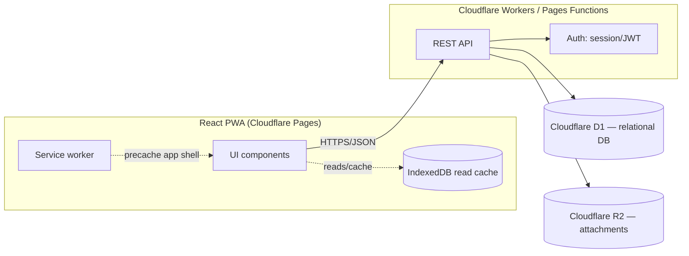
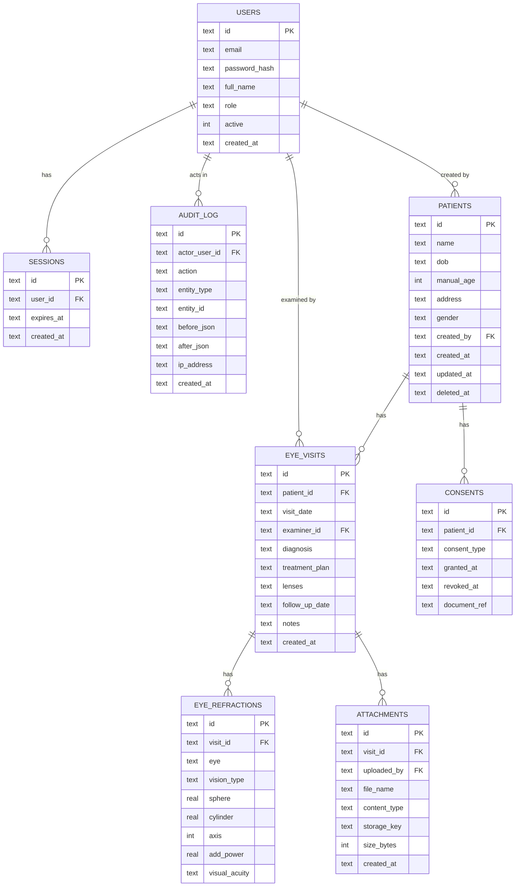

# Eye Care Records — System Design

Status: **draft, for future implementation**. This document specifies the
target architecture and schema for evolving the current client-only MVP into
a multi-user, backend-synced clinical records system. Nothing here is
implemented yet — it is the blueprint the next implementation phases build
against.

## 1. Scope decisions (locked in for this design)

These were confirmed before writing this doc and drive every section below:

| Decision | Choice |
|---|---|
| Data architecture | Backend + database (not local-only) — multi-device sync, durable storage |
| User accounts | Multiple staff accounts with distinct logins, roles, and an audit trail |
| Clinical fields | Per eye, **Distance** and **Reading** prescriptions (sphere, cylinder, axis, visual acuity each), Add power for reading, a free-text Lenses line, diagnosis/treatment plan text, attachments (images/scans) — modeled directly on a real prescription pad (see §5.2) |
| Compliance | Design includes health-data safeguards (encryption, audit logging, retention/export/erasure, consent) from the start |

## 2. Goals / Non-goals

**Goals**
- Durable, centralized storage for patient and clinical data — survives device loss, accessible from multiple staff devices.
- Distinct staff accounts with role-appropriate access (front desk shouldn't see clinical detail; only clinicians record prescriptions/diagnoses).
- A complete refraction record per visit — distance and reading prescriptions (sphere, cylinder, axis, visual acuity) per eye, plus add power, lenses, diagnosis/treatment plan, and file attachments.
- An audit trail of who created/changed what, and when.
- A defensible baseline for handling health data: encryption, retention, export, and erasure.
- The existing PWA (install, offline shell) is preserved — this is additive, not a rewrite of the client framework.

**Non-goals (this phase)**
- Real-time collaborative editing (two staff editing the same record simultaneously).
- Billing/insurance, scheduling/appointments, e-prescribing integrations.
- Full offline write support (queued writes while offline, synced later) — Phase 1 targets **online-required writes, offline-cached reads**; true offline writes are called out as a later phase (§8).
- HIPAA/GDPR certification — this document establishes the technical safeguards a compliance program would need, not a legal compliance sign-off.

## 3. Architecture

### 3.1 Current state (recap)

React + Vite PWA, all state in `localStorage`, no backend, no auth. Single
implicit user (whoever has the device). This is what exists in the repo today.

### 3.2 Target architecture



### 3.3 Platform choice

The frontend is already deployed on Cloudflare Pages, so the backend stays in
the same ecosystem to avoid a second platform/bill:

- **API**: Cloudflare Pages Functions (or a Worker) — same deploy pipeline, same account.
- **Database**: Cloudflare D1 (SQLite-compatible, serverless, free tier fits a small clinic's data volume).
- **File storage**: Cloudflare R2 (S3-compatible) for attachments (images/scans).
- **Auth**: server-issued session cookie (httpOnly, `Secure`, `SameSite=Strict`) backed by a `sessions` table — simpler to reason about and revoke than raw JWTs for a low-traffic internal tool.

If data volume or query complexity later outgrows D1, the schema in §5 is
standard relational SQL and ports to Postgres (Neon/Supabase) with minimal
changes (see column-type notes in §5.3).

## 4. User roles & permissions

| Role | Can view demographics | Can create/edit demographics | Can view/edit clinical records (visits, refraction, diagnosis) | Can manage attachments | Can manage staff accounts | Can view audit log |
|---|---|---|---|---|---|---|
| `admin` | ✅ | ✅ | ✅ | ✅ | ✅ | ✅ |
| `doctor` | ✅ | ✅ | ✅ | ✅ | ❌ | ❌ |
| `front_desk` | ✅ | ✅ | ❌ (no SPH/CYL/diagnosis) | ❌ | ❌ | ❌ |

Front desk can register a new patient and edit name/DOB/address/gender —
e.g. at check-in, before a clinician ever opens the chart — but the API
rejects any `front_desk`-authenticated request touching `eye_visits`,
`eye_refractions`, or `attachments` (§6), regardless of what the client
sends.

Permissions are enforced **server-side** on every API call — the role in the
session determines what the API returns/accepts, never trust the client.
Modeled as a `role` enum on the user for now (§5); if permission needs get
more granular later (e.g. per-patient access lists), split into `roles` +
`permissions` + join tables without changing the rest of the schema.

## 5. Data model

### 5.1 Entity overview



### 5.2 Field notes / definitions

- **Age**: never stored as a derived value. If `patients.dob` is set, age is
  computed at read time (same logic as today's `computeAgeFromDob`). If
  `dob` is null, `manual_age` is authoritative. Exactly one of the two
  should be considered "current" at a time — enforced in application logic,
  not a DB constraint (SQLite has no partial-exclusion constraints worth the
  complexity here).
- **Refraction shape — modeled directly on a real prescription pad**: a
  physical prescription (see below) has two *rows* per eye, not one —
  **Distance** vision and **Reading** (near) vision — each with its own
  Sphere, Cylinder, Axis, and Visual Acuity. `eye_refractions` captures this
  as one row per `(eye, vision_type)` pair, so a single visit produces up to
  four rows: left/distance, left/reading, right/distance, right/reading.

  ```
                    RIGHT EYE                          LEFT EYE
              D.Sph   D.Cyl   Axis   V.A         D.Sph   D.Cyl   Axis   V.A
  Distance     ...     -0.25   110°   6/6         -0.25   -0.25   40°    6/6
  Reading     Add +1.5  ...    ...    N/6          ...     ...    ...    N/6
  ```

  This replaces the earlier single ambiguous "distance" field from the first
  draft of this document — resolving Open Question #1 below.
- **`eye` enum**: `'left' | 'right'`.
- **`vision_type` enum**: `'distance' | 'reading'` — which row of the
  prescription this is.
- **Sphere / cylinder**: signed decimals, diopters (e.g. `-0.25`, `+2.00`).
  Nullable — a reading row may only carry `add_power` and leave sphere/
  cylinder blank if the clinic's convention is "same as distance, see Add".
  Stored as `REAL` (D1/SQLite) — see §5.3 for Postgres equivalent (`NUMERIC(5,2)`).
- **Axis**: integer 0–180 (degrees). Not signed — enforce range in application
  validation (`CHECK` constraint optionally added in D1/SQLite 3.37+).
- **`add_power`**: signed decimal, diopters — the near-vision addition,
  primarily meaningful when `vision_type = 'reading'`.
- **`visual_acuity`**: free text (e.g. `"6/6"` for distance, `"N/6"` for
  reading) rather than a fixed enum — acuity notations vary by clinic/chart
  (Snellen feet, Snellen metric, Snellen near-point) and forcing a single
  format would lose information from the source chart.
- **`eye_visits.lenses`**: free-text line (e.g. "progressive", "bifocal",
  "single vision, anti-glare") — matches the "Lenses …" line on the
  prescription pad; one per visit, not per eye.
- **`manual_age`**: nullable integer, only meaningful when `dob` is null.
- **Soft delete**: `patients.deleted_at` — patient rows are never hard-deleted
  by normal staff action (needed for audit trail integrity); hard delete is a
  separate admin-triggered erasure workflow (§8.4).
- **`audit_log.before_json` / `after_json`**: snapshot of the changed row
  (JSON-encoded), not full-table diffs — enough to reconstruct history without
  a general-purpose event-sourcing system.

### 5.3 Schema (Cloudflare D1 / SQLite dialect)

```sql
PRAGMA foreign_keys = ON;

CREATE TABLE users (
    id            TEXT PRIMARY KEY,             -- uuid, generated by application
    email         TEXT NOT NULL UNIQUE,
    password_hash TEXT NOT NULL,                -- argon2id/bcrypt hash, never plaintext
    full_name     TEXT NOT NULL,
    role          TEXT NOT NULL CHECK (role IN ('admin', 'doctor', 'front_desk')),
    active        INTEGER NOT NULL DEFAULT 1,   -- boolean
    created_at    TEXT NOT NULL DEFAULT (datetime('now')),
    last_login_at TEXT
);

CREATE TABLE sessions (
    id         TEXT PRIMARY KEY,                -- opaque random token, hashed before storage
    user_id    TEXT NOT NULL REFERENCES users(id) ON DELETE CASCADE,
    expires_at TEXT NOT NULL,
    created_at TEXT NOT NULL DEFAULT (datetime('now'))
);
CREATE INDEX idx_sessions_user ON sessions(user_id);

CREATE TABLE patients (
    id          TEXT PRIMARY KEY,
    name        TEXT NOT NULL,
    dob         TEXT,                           -- ISO date (YYYY-MM-DD); null if unknown
    manual_age  INTEGER,                        -- only used when dob is null
    address     TEXT,
    gender      TEXT NOT NULL CHECK (gender IN ('female', 'male', 'other', 'unspecified')),
    created_by  TEXT REFERENCES users(id),
    created_at  TEXT NOT NULL DEFAULT (datetime('now')),
    updated_at  TEXT NOT NULL DEFAULT (datetime('now')),
    deleted_at  TEXT                            -- soft delete; null = active
);
CREATE INDEX idx_patients_name ON patients(name);
CREATE INDEX idx_patients_deleted_at ON patients(deleted_at);

CREATE TABLE eye_visits (
    id             TEXT PRIMARY KEY,
    patient_id     TEXT NOT NULL REFERENCES patients(id) ON DELETE CASCADE,
    visit_date     TEXT NOT NULL,               -- ISO date
    examiner_id    TEXT REFERENCES users(id),
    diagnosis      TEXT,
    treatment_plan TEXT,
    lenses         TEXT,                        -- free text, e.g. "progressive", "bifocal"
    follow_up_date TEXT,
    notes          TEXT,
    created_at     TEXT NOT NULL DEFAULT (datetime('now')),
    updated_at     TEXT NOT NULL DEFAULT (datetime('now'))
);
CREATE INDEX idx_visits_patient ON eye_visits(patient_id, visit_date DESC);

-- One row per (eye, vision_type): up to 4 rows per visit
-- (left/distance, left/reading, right/distance, right/reading),
-- mirroring a standard Distance/Reading x Right/Left prescription pad.
CREATE TABLE eye_refractions (
    id            TEXT PRIMARY KEY,
    visit_id      TEXT NOT NULL REFERENCES eye_visits(id) ON DELETE CASCADE,
    eye           TEXT NOT NULL CHECK (eye IN ('left', 'right')),
    vision_type   TEXT NOT NULL CHECK (vision_type IN ('distance', 'reading')),
    sphere        REAL,
    cylinder      REAL,
    axis          INTEGER CHECK (axis IS NULL OR (axis >= 0 AND axis <= 180)),
    add_power     REAL,                         -- near-vision addition; mainly for 'reading' rows
    visual_acuity TEXT,                         -- e.g. "6/6", "N/6" — free text, chart-dependent notation
    UNIQUE (visit_id, eye, vision_type)
);
CREATE INDEX idx_refractions_visit ON eye_refractions(visit_id);

CREATE TABLE attachments (
    id           TEXT PRIMARY KEY,
    visit_id     TEXT NOT NULL REFERENCES eye_visits(id) ON DELETE CASCADE,
    uploaded_by  TEXT REFERENCES users(id),
    file_name    TEXT NOT NULL,
    content_type TEXT NOT NULL,
    storage_key  TEXT NOT NULL,                 -- R2 object key
    size_bytes   INTEGER NOT NULL,
    created_at   TEXT NOT NULL DEFAULT (datetime('now'))
);
CREATE INDEX idx_attachments_visit ON attachments(visit_id);

CREATE TABLE consents (
    id            TEXT PRIMARY KEY,
    patient_id    TEXT NOT NULL REFERENCES patients(id) ON DELETE CASCADE,
    consent_type  TEXT NOT NULL,                -- e.g. "treatment", "data_processing"
    granted_at    TEXT NOT NULL DEFAULT (datetime('now')),
    revoked_at    TEXT,
    document_ref  TEXT                          -- R2 key for a signed consent form, if any
);
CREATE INDEX idx_consents_patient ON consents(patient_id);

CREATE TABLE audit_log (
    id             TEXT PRIMARY KEY,
    actor_user_id  TEXT REFERENCES users(id),
    action         TEXT NOT NULL CHECK (action IN ('create', 'update', 'delete', 'export')),
    entity_type    TEXT NOT NULL,               -- 'patient' | 'eye_visit' | 'attachment' | ...
    entity_id      TEXT NOT NULL,
    before_json    TEXT,
    after_json     TEXT,
    ip_address     TEXT,
    created_at     TEXT NOT NULL DEFAULT (datetime('now'))
);
CREATE INDEX idx_audit_entity ON audit_log(entity_type, entity_id);
CREATE INDEX idx_audit_actor ON audit_log(actor_user_id, created_at);
```

**Porting to Postgres later**: `TEXT` timestamp/date columns → `TIMESTAMPTZ`/`DATE`;
`TEXT` id columns → native `UUID` with `gen_random_uuid()`; `REAL` → `NUMERIC(5,2)`;
`INTEGER` booleans → native `BOOLEAN`; `CHECK (... IN (...))` → native `ENUM` types.

## 6. API surface (v1)

All endpoints under `/api`, JSON in/out, session cookie required except `/auth/login`.
Every mutating endpoint writes an `audit_log` row server-side.

| Method & path | Role required | Purpose |
|---|---|---|
| `POST /auth/login` | — | Authenticate, set session cookie |
| `POST /auth/logout` | any | Invalidate session |
| `GET /auth/me` | any | Current user + role |
| `GET /users` | admin | List staff accounts |
| `POST /users` | admin | Create staff account |
| `PATCH /users/:id` | admin | Update role/active status |
| `GET /patients?search=` | any | List/search patients (front desk sees demographics only — response shaped by role) |
| `POST /patients` | admin, doctor, front_desk | Create patient (demographics only — request body may not include clinical fields) |
| `GET /patients/:id` | any | Patient detail (role-shaped response) |
| `PATCH /patients/:id` | admin, doctor, front_desk | Update demographics |
| `DELETE /patients/:id` | admin | Soft-delete patient (+ cascade note in audit log) |
| `GET /patients/:id/visits` | admin, doctor | Visit history for a patient |
| `POST /patients/:id/visits` | admin, doctor | Create a visit — one payload containing up to 4 refraction rows (distance/reading × left/right), diagnosis, treatment plan, and lenses |
| `GET /visits/:id` | admin, doctor | Single visit detail |
| `PATCH /visits/:id` | admin, doctor | Update a visit |
| `DELETE /visits/:id` | admin | Delete a visit |
| `POST /visits/:id/attachments` | admin, doctor | Upload a file (multipart → R2) |
| `GET /attachments/:id` | admin, doctor | Fetch (redirect to a short-lived signed R2 URL) |
| `DELETE /attachments/:id` | admin | Remove attachment |
| `GET /patients/:id/export` | admin | Full patient data export (JSON/PDF) — data portability |
| `GET /audit-log?entity_type=&entity_id=` | admin | Audit trail lookup |

## 7. Client changes (high level)

- Replace direct `localStorage` reads/writes in `usePatients`/`useEyeRecords`
  with calls to the API, backed by an IndexedDB cache for offline reads
  (e.g. via a small wrapper or a library like `idb`).
- Add a login screen + auth context; role gates which UI sections render
  (front-desk users don't see refraction/diagnosis forms at all, not just
  disabled).
- Rework `EyeRecordForm`/`EyeRecordHistory` around the Distance/Reading ×
  Left/Right grid (§5.2) instead of the current single sphere/cylinder/
  distance-per-eye fields — plus diagnosis/treatment plan, lenses, and
  attachment upload/preview.
- Existing offline-shell behavior (service worker precache, install banners)
  is unaffected — it's a separate concern from data sync.

## 8. Offline sync strategy (phased)

1. **Phase 1 (this design's target)**: writes require connectivity; reads are
   served from an IndexedDB cache populated on last successful fetch, so the
   app is still browsable offline, just not editable.
2. **Phase 2**: queued writes — mutations made offline are stored in an
   "outbox" table client-side and replayed on reconnect, in order.
3. **Phase 3**: conflict handling for the outbox — add a `version` integer
   column to mutable tables (`patients`, `eye_visits`), incremented per
   update; the API rejects writes whose `version` doesn't match current
   state, and the client surfaces a merge/overwrite prompt.

Phases 2–3 are called out but explicitly deferred (see Non-goals) — only
build them if multi-device offline editing turns out to be a real need.

## 9. Security & compliance

- **Transport**: TLS everywhere (Cloudflare terminates this automatically).
- **At rest**: D1 and R2 encrypt at rest by default; no additional
  application-level encryption planned initially. Revisit field-level
  encryption for `patients.address`/`name` only if a future threat model
  requires it (adds significant key-management complexity for a small
  clinic tool).
- **Authentication**: password hashed with argon2id (or bcrypt if the
  runtime lacks argon2 support); session tokens are random, hashed before
  storage in `sessions`, short expiry with sliding renewal.
- **Authorization**: enforced per-request server-side from `users.role`
  (§4) — never inferred from client state.
- **Audit trail**: every create/update/delete/export is logged to
  `audit_log` with actor, before/after snapshot, and timestamp (§5.3).
  Read-access logging (who *viewed* a chart, not just who changed it) is
  not in Phase 1 — add an `action = 'view'` audit path later if required by
  a specific compliance regime.
- **Consent**: `consents` table tracks what a patient has agreed to, with
  grant/revoke timestamps and an optional signed-document reference in R2.
- **Retention / right to erasure**: patients are soft-deleted by default
  (`deleted_at`); a separate admin-only **hard delete** workflow physically
  removes the row and cascaded visits/attachments after confirmation, and
  records the erasure itself in `audit_log` (actor + timestamp only — no
  patient PHI retained in that log entry once erased).
- **Data portability**: `GET /patients/:id/export` produces a full JSON (or
  PDF) export of everything the schema holds for that patient.

## 10. Non-functional requirements

- **Scale**: designed for a single small-to-mid clinic (hundreds to low
  thousands of patients, tens of visits/day) — well within D1's free-tier
  limits. Revisit if usage crosses into multi-clinic/enterprise territory.
- **Backup**: rely on Cloudflare D1's built-in point-in-time recovery;
  supplement with a scheduled export job (reuses the `/export` endpoint) to
  R2 as an independent backup if stronger guarantees are needed later.
- **Availability**: Cloudflare's edge network; no additional HA design needed
  at this scale.

## 11. Migration plan from current MVP

1. Stand up the D1 database and Pages Functions API with the schema in §5,
   deployed alongside the existing static site (no client changes yet).
2. Add auth (login screen, session handling) gated behind a feature flag so
   the current localStorage flow keeps working until the API is verified.
3. Swap `usePatients`/`useEyeRecords` to call the API instead of
   `localStorage`, with a one-time client-side import tool that reads any
   existing `localStorage` data and POSTs it to the new API (so early
   testers/demo data isn't lost).
4. Add the new clinical fields (axis, add, visual acuity, diagnosis/plan,
   attachments) to the forms and history view.
5. Remove the localStorage code path once the API path is confirmed stable.

## 12. Open questions / future extensions

- ~~"Distance" field semantics~~ — **resolved**: it's the Distance-vision row
  of a two-row (Distance/Reading) prescription per eye, per a real
  prescription pad reviewed during design (§5.2), not a single ambiguous
  measurement.
- ~~Should `front_desk` be able to *create* a patient (demographics only)~~ —
  **resolved: yes.** Front desk can create/edit demographics (name, DOB,
  address, gender) but the API blocks any `front_desk` request touching
  `eye_visits`/`eye_refractions`/`attachments` (§4, §6).
- Multi-clinic / multi-location support is not modeled (no `clinic_id`
  anywhere) — add a `clinics` table and scope everything to it if/when a
  second location is added.
- Appointment scheduling and billing are intentionally out of scope; if
  needed later, they're additive tables (`appointments`, `invoices`) that
  reference `patients`/`eye_visits` without changing what's here.
