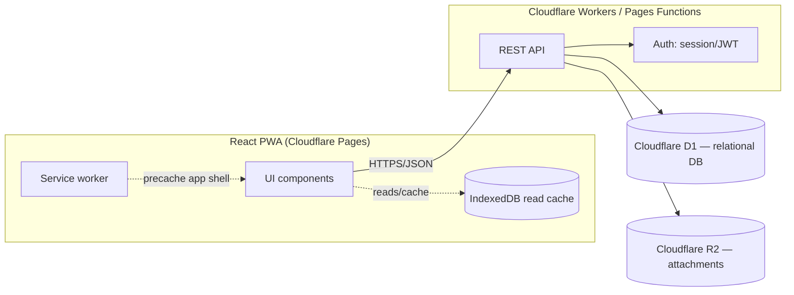
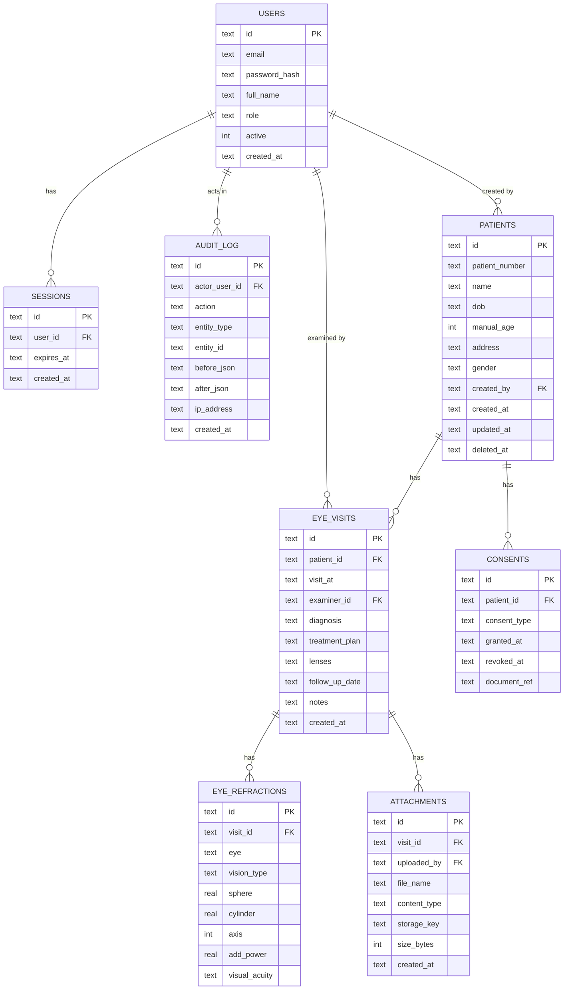

# Eye Care Records — System Design

Status: **draft, for future implementation**. This document specifies the
target architecture and schema for evolving the current client-only MVP into
a multi-user, backend-synced clinical records system. Nothing here is
implemented yet — it is the blueprint the next implementation phases build
against.

## 1. Scope decisions (locked in for this design)

These were confirmed before writing this doc and drive every section below:

| Decision | Choice |
|---|---|
| Data architecture | Backend + database (not local-only) — multi-device sync, durable storage |
| User accounts | Multiple staff accounts with distinct logins, roles, and an audit trail |
| Clinical fields | Per eye, **Distance** and **Reading** prescriptions (sphere, cylinder, axis, visual acuity each), Add power for reading, a free-text Lenses line, diagnosis/treatment plan text, attachments (images/scans) — modeled directly on a real prescription pad (see §5.2) |
| Compliance | Design includes health-data safeguards (encryption, audit logging, retention/export/erasure, consent) from the start |

## 2. Goals / Non-goals

**Goals**
- Durable, centralized storage for patient and clinical data — survives device loss, accessible from multiple staff devices.
- Distinct staff accounts with role-appropriate access (front desk can enter/edit clinical records but never deletes them; deletion is admin-only).
- A complete refraction record per visit — distance and reading prescriptions (sphere, cylinder, axis, visual acuity) per eye, plus add power, lenses, diagnosis/treatment plan, and file attachments.
- An audit trail of who created/changed what, and when.
- A defensible baseline for handling health data: encryption, retention, export, and erasure.
- The existing PWA (install, offline shell) is preserved — this is additive, not a rewrite of the client framework.

**Non-goals (this phase)**
- Real-time collaborative editing (two staff editing the same record simultaneously).
- Billing/insurance, scheduling/appointments, e-prescribing integrations.
- Full offline write support (queued writes while offline, synced later) — Phase 1 targets **online-required writes, offline-cached reads**; true offline writes are called out as a later phase (§9).
- HIPAA/GDPR certification — this document establishes the technical safeguards a compliance program would need, not a legal compliance sign-off.

## 3. Architecture

### 3.1 Current state (recap)

React + Vite PWA, all state in `localStorage`, no backend, no auth. Single
implicit user (whoever has the device). This is what exists in the repo today.

### 3.2 Target architecture



### 3.3 Platform choice

The frontend is already deployed on Cloudflare Pages, so the backend stays in
the same ecosystem to avoid a second platform/bill:

- **API**: Cloudflare Pages Functions (or a Worker) — same deploy pipeline, same account.
- **Database**: Cloudflare D1 (SQLite-compatible, serverless, free tier fits a small clinic's data volume).
- **File storage**: Cloudflare R2 (S3-compatible) for attachments (images/scans).
- **Auth**: server-issued session cookie (httpOnly, `Secure`, `SameSite=Strict`) backed by a `sessions` table — simpler to reason about and revoke than raw JWTs for a low-traffic internal tool.

If data volume or query complexity later outgrows D1, the schema in §5 is
standard relational SQL and ports to Postgres (Neon/Supabase) with minimal
changes (see column-type notes in §5.3).

## 4. User roles & permissions

| Role | Can view demographics | Can create/edit demographics | Can view/create/edit clinical records (visits, refraction, diagnosis) | Can delete clinical records | Can manage attachments (upload/view) | Can manage staff accounts | Can view audit log |
|---|---|---|---|---|---|---|---|
| `admin` | ✅ | ✅ | ✅ | ✅ | ✅ | ✅ | ✅ |
| `doctor` | ✅ | ✅ | ✅ | ❌ | ✅ | ❌ | ❌ |
| `front_desk` | ✅ | ✅ | ✅ | ❌ | ❌ | ❌ | ❌ |

Front desk can register a new patient and edit name/DOB/address/gender —
e.g. at check-in, before a clinician ever opens the chart. Front desk can
also **create and edit** clinical records — a common workflow is
transcribing a doctor's handwritten prescription card into the system —
but cannot **delete** a visit, refraction row, or attachment; deletion of
any clinical record is admin-only, same restriction doctors already have.
The API rejects any `front_desk`-authenticated request touching
`attachments` at all (upload or delete), and rejects any `DELETE` on
`eye_visits`/`eye_refractions` from anyone but `admin` (§6), regardless of
what the client sends.

Permissions are enforced **server-side** on every API call — the role in the
session determines what the API returns/accepts, never trust the client.
Modeled as a `role` enum on the user for now (§5); if permission needs get
more granular later (e.g. per-patient access lists), split into `roles` +
`permissions` + join tables without changing the rest of the schema.

## 5. Data model

### 5.1 Entity overview



### 5.2 Field notes / definitions

- **`patients.patient_number`** — the human-facing patient ID (distinct from
  `patients.id`, which stays an opaque UUID used only internally for foreign
  keys). Format: **`P-YYYYMMDD-NNNN`** — registration date + a 4-digit
  sequence that resets daily (e.g. `P-20260705-0007` = the 7th patient
  registered on 2026-07-05). This is what's shown in the UI, printed on a
  physical file/label, and read aloud over the phone — not the UUID.
  - **Monotonically increasing**: because the date prefix always increases
    and the sequence is zero-padded to a fixed width, sorting
    `patient_number` as plain text always matches registration order —
    no need to parse it or join to `created_at` to get chronological order.
  - **Generation**: assigned once at creation, immutable after. Computed
    atomically via a small counters table (`patient_number_counters`, §5.3)
    keyed by date, incremented with a single `UPDATE ... RETURNING` inside
    the same transaction as the `INSERT INTO patients`, so two concurrent
    registrations on the same day never collide — no read-then-write race.
  - **Capacity**: 4 digits supports 9,999 new registrations/day, far beyond
    a small clinic's volume (§11); widen to 5+ digits if that changes.
  - `UNIQUE NOT NULL` — enforced at the DB level as a backstop even though
    generation is already collision-free by construction.
  - **Search**: `GET /patients?search=` (§6) matches name or `patient_number`
    in one query:
    ```sql
    SELECT id, patient_number, name, dob, manual_age, gender
    FROM patients
    WHERE deleted_at IS NULL
      AND (name LIKE '%' || :q || '%' COLLATE NOCASE
           OR patient_number LIKE '%' || :q || '%')
    ORDER BY created_at DESC;
    ```
    A leading-wildcard `LIKE` can't use the `patient_number`/`name` indexes,
    but at clinic scale (§11: hundreds–low thousands of rows) a full scan is
    still sub-millisecond — no need for FTS5 or trigram indexing yet.
  - **Minimum query length: 3 characters.** A 1–2 character query against a
    leading-wildcard `LIKE` on `name` matches a large fraction of any real
    patient list (e.g. `"an"` matches every "*an*"), which is neither a
    useful result nor a cheap query at scale. The API rejects
    `search` values shorter than 3 characters with `400 Bad Request`; the
    client never sends one in the first place (§7).
- **Age**: never stored as a derived value. If `patients.dob` is set, age is
  computed at read time (same logic as today's `computeAgeFromDob`). If
  `dob` is null, `manual_age` is authoritative. Exactly one of the two
  should be considered "current" at a time — enforced in application logic,
  not a DB constraint (SQLite has no partial-exclusion constraints worth the
  complexity here).
- **Refraction shape — modeled directly on a real prescription pad**: a
  physical prescription (see below) has two *rows* per eye, not one —
  **Distance** vision and **Reading** (near) vision — each with its own
  Sphere, Cylinder, Axis, and Visual Acuity. `eye_refractions` captures this
  as one row per `(eye, vision_type)` pair, so a single visit produces up to
  four rows: left/distance, left/reading, right/distance, right/reading.

  ```
                    RIGHT EYE                          LEFT EYE
              D.Sph   D.Cyl   Axis   V.A         D.Sph   D.Cyl   Axis   V.A
  Distance     ...     -0.25   110°   6/6         -0.25   -0.25   40°    6/6
  Reading     Add +1.5  ...    ...    N/6          ...     ...    ...    N/6
  ```

  This replaces the earlier single ambiguous "distance" field from the first
  draft of this document — resolving Open Question #1 below.
- **`eye` enum**: `'left' | 'right'`.
- **`vision_type` enum**: `'distance' | 'reading'` — which row of the
  prescription this is.
- **Sphere / cylinder**: signed decimals, diopters (e.g. `-0.25`, `+2.00`).
  Nullable — a reading row may only carry `add_power` and leave sphere/
  cylinder blank if the clinic's convention is "same as distance, see Add".
  Stored as `REAL` (D1/SQLite) — see §5.3 for Postgres equivalent (`NUMERIC(5,2)`).
- **Axis**: integer 0–180 (degrees). Not signed — enforce range in application
  validation (`CHECK` constraint optionally added in D1/SQLite 3.37+).
- **`add_power`**: signed decimal, diopters — the near-vision addition,
  primarily meaningful when `vision_type = 'reading'`.
- **`visual_acuity`**: free text (e.g. `"6/6"` for distance, `"N/6"` for
  reading) rather than a fixed enum — acuity notations vary by clinic/chart
  (Snellen feet, Snellen metric, Snellen near-point) and forcing a single
  format would lose information from the source chart.
- **`eye_visits.lenses`**: free-text line (e.g. "progressive", "bifocal",
  "single vision, anti-glare") — matches the "Lenses …" line on the
  prescription pad; one per visit, not per eye.
- **`manual_age`**: nullable integer, only meaningful when `dob` is null.
- **Soft delete**: `patients.deleted_at` — patient rows are never hard-deleted
  by normal staff action (needed for audit trail integrity); hard delete is a
  separate admin-triggered erasure workflow (§10).
- **`audit_log.before_json` / `after_json`**: snapshot of the changed row
  (JSON-encoded), not full-table diffs — enough to reconstruct history without
  a general-purpose event-sourcing system.
- **Timestamps & default sort order**: every record-bearing table carries a
  proper datetime, and every list view has a defined default sort — never
  incidental insertion order:
  - `patients.created_at` — when the patient was registered. Patient lists
    default to **newest-registered-first** (`created_at DESC`), backed by
    `idx_patients_created_at`.
  - `eye_visits.visit_at` — a full **date + time** of the exam (not just a
    date), distinct from `eye_visits.created_at` (when the row was entered
    into the system, which may be later — e.g. front desk transcribing a
    paper chart the next day). Visit history defaults to
    **most-recent-visit-first** (`visit_at DESC`), backed by
    `idx_visits_patient`. Using a full timestamp (rather than a date) means
    two same-day visits sort deterministically by time, not by insertion
    order.
  - This is a formal contract of the API (§6), not just a UI convenience —
    the server guarantees the order, so the client never needs its own
    sort-by-date logic to get a correct default view.

### 5.3 Schema (Cloudflare D1 / SQLite dialect)

```sql
PRAGMA foreign_keys = ON;

CREATE TABLE users (
    id            TEXT PRIMARY KEY,             -- uuid, generated by application
    email         TEXT NOT NULL UNIQUE,
    password_hash TEXT NOT NULL,                -- argon2id/bcrypt hash, never plaintext
    full_name     TEXT NOT NULL,
    role          TEXT NOT NULL CHECK (role IN ('admin', 'doctor', 'front_desk')),
    active        INTEGER NOT NULL DEFAULT 1,   -- boolean
    created_at    TEXT NOT NULL DEFAULT (datetime('now')),
    last_login_at TEXT
);

CREATE TABLE sessions (
    id         TEXT PRIMARY KEY,                -- opaque random token, hashed before storage
    user_id    TEXT NOT NULL REFERENCES users(id) ON DELETE CASCADE,
    expires_at TEXT NOT NULL,
    created_at TEXT NOT NULL DEFAULT (datetime('now'))
);
CREATE INDEX idx_sessions_user ON sessions(user_id);

-- Backs atomic generation of patients.patient_number (one row per calendar day).
CREATE TABLE patient_number_counters (
    date_key TEXT PRIMARY KEY,                  -- 'YYYYMMDD'
    next_seq INTEGER NOT NULL DEFAULT 1
);

CREATE TABLE patients (
    id             TEXT PRIMARY KEY,             -- opaque UUID; internal FK target only
    patient_number TEXT NOT NULL UNIQUE,         -- e.g. "P-20260705-0007"; human-facing ID (§5.2)
    name           TEXT NOT NULL,
    dob            TEXT,                         -- ISO date (YYYY-MM-DD); null if unknown
    manual_age     INTEGER,                      -- only used when dob is null
    address        TEXT,
    gender         TEXT NOT NULL CHECK (gender IN ('female', 'male', 'other', 'unspecified')),
    created_by     TEXT REFERENCES users(id),
    created_at     TEXT NOT NULL DEFAULT (datetime('now')),
    updated_at     TEXT NOT NULL DEFAULT (datetime('now')),
    deleted_at     TEXT                          -- soft delete; null = active
);
CREATE INDEX idx_patients_name ON patients(name);
CREATE INDEX idx_patients_deleted_at ON patients(deleted_at);
CREATE INDEX idx_patients_created_at ON patients(created_at DESC);  -- supports default sort (§6)

CREATE TABLE eye_visits (
    id             TEXT PRIMARY KEY,
    patient_id     TEXT NOT NULL REFERENCES patients(id) ON DELETE CASCADE,
    visit_at       TEXT NOT NULL,               -- ISO-8601 datetime (date + time) of the exam
    examiner_id    TEXT REFERENCES users(id),
    diagnosis      TEXT,
    treatment_plan TEXT,
    lenses         TEXT,                        -- free text, e.g. "progressive", "bifocal"
    follow_up_date TEXT,
    notes          TEXT,
    created_at     TEXT NOT NULL DEFAULT (datetime('now')),
    updated_at     TEXT NOT NULL DEFAULT (datetime('now'))
);
CREATE INDEX idx_visits_patient ON eye_visits(patient_id, visit_at DESC);

-- One row per (eye, vision_type): up to 4 rows per visit
-- (left/distance, left/reading, right/distance, right/reading),
-- mirroring a standard Distance/Reading x Right/Left prescription pad.
CREATE TABLE eye_refractions (
    id            TEXT PRIMARY KEY,
    visit_id      TEXT NOT NULL REFERENCES eye_visits(id) ON DELETE CASCADE,
    eye           TEXT NOT NULL CHECK (eye IN ('left', 'right')),
    vision_type   TEXT NOT NULL CHECK (vision_type IN ('distance', 'reading')),
    sphere        REAL,
    cylinder      REAL,
    axis          INTEGER CHECK (axis IS NULL OR (axis >= 0 AND axis <= 180)),
    add_power     REAL,                         -- near-vision addition; mainly for 'reading' rows
    visual_acuity TEXT,                         -- e.g. "6/6", "N/6" — free text, chart-dependent notation
    UNIQUE (visit_id, eye, vision_type)
);
CREATE INDEX idx_refractions_visit ON eye_refractions(visit_id);

CREATE TABLE attachments (
    id           TEXT PRIMARY KEY,
    visit_id     TEXT NOT NULL REFERENCES eye_visits(id) ON DELETE CASCADE,
    uploaded_by  TEXT REFERENCES users(id),
    file_name    TEXT NOT NULL,
    content_type TEXT NOT NULL,
    storage_key  TEXT NOT NULL,                 -- R2 object key
    size_bytes   INTEGER NOT NULL,
    created_at   TEXT NOT NULL DEFAULT (datetime('now'))
);
CREATE INDEX idx_attachments_visit ON attachments(visit_id);

CREATE TABLE consents (
    id            TEXT PRIMARY KEY,
    patient_id    TEXT NOT NULL REFERENCES patients(id) ON DELETE CASCADE,
    consent_type  TEXT NOT NULL,                -- e.g. "treatment", "data_processing"
    granted_at    TEXT NOT NULL DEFAULT (datetime('now')),
    revoked_at    TEXT,
    document_ref  TEXT                          -- R2 key for a signed consent form, if any
);
CREATE INDEX idx_consents_patient ON consents(patient_id);

CREATE TABLE audit_log (
    id             TEXT PRIMARY KEY,
    actor_user_id  TEXT REFERENCES users(id),
    action         TEXT NOT NULL CHECK (action IN ('create', 'update', 'delete', 'export')),
    entity_type    TEXT NOT NULL,               -- 'patient' | 'eye_visit' | 'attachment' | ...
    entity_id      TEXT NOT NULL,
    before_json    TEXT,
    after_json     TEXT,
    ip_address     TEXT,
    created_at     TEXT NOT NULL DEFAULT (datetime('now'))
);
CREATE INDEX idx_audit_entity ON audit_log(entity_type, entity_id);
CREATE INDEX idx_audit_actor ON audit_log(actor_user_id, created_at);
```

**Porting to Postgres later**: `TEXT` timestamp/date columns → `TIMESTAMPTZ`/`DATE`;
`TEXT` id columns → native `UUID` with `gen_random_uuid()`; `REAL` → `NUMERIC(5,2)`;
`INTEGER` booleans → native `BOOLEAN`; `CHECK (... IN (...))` → native `ENUM` types.

**Generating `patient_number` (example)** — run inside the same transaction
as the `INSERT INTO patients`:

```sql
INSERT INTO patient_number_counters (date_key, next_seq)
VALUES (:date_key, 2)
ON CONFLICT (date_key) DO UPDATE SET next_seq = next_seq + 1
RETURNING next_seq - 1 AS seq;
-- :date_key = strftime('%Y%m%d', 'now'); patient_number = 'P-' || :date_key || '-' || printf('%04d', seq)
```

This is a single atomic upsert-and-return — two concurrent registrations on
the same day each get a distinct `seq` with no read-then-write gap to race on.

**On Postgres**, the equivalent is a `SEQUENCE` per day (or a single
`BIGSERIAL` with the date formatted separately) — either works; the emphasis
here is "atomic increment, not read-max-then-add-one", which both engines
support.

## 6. API surface (v1)

All endpoints under `/api`, JSON in/out, session cookie required except `/auth/login`.
Every mutating endpoint writes an `audit_log` row server-side. Every endpoint
that returns a list has a fixed **default sort order** (noted per row below);
callers can override with an explicit `?sort=` param later if ever needed,
but the unsorted default is never "whatever order the DB happened to return."

| Method & path | Role required | Purpose | Default sort |
|---|---|---|---|
| `POST /auth/login` | — | Authenticate, set session cookie | — |
| `POST /auth/logout` | any | Invalidate session | — |
| `GET /auth/me` | any | Current user + role | — |
| `GET /users` | admin | List staff accounts | `full_name` asc |
| `POST /users` | admin | Create staff account | — |
| `PATCH /users/:id` | admin | Update role/active status | — |
| `GET /patients?search=` | any | List/search patients — one query box, matches **name** (substring, case-insensitive) **or** `patient_number` (substring match, so typing a partial number or a date prefix like `P-20260705` also works) in a single OR'd query (§5.2). `search` must be ≥3 characters or omitted; shorter values → `400`. Summary rows only (`patient_number`/name/age/gender); full clinical detail lives on the visit endpoints below | `created_at` **desc** (newest-registered first) |
| `POST /patients` | admin, doctor, front_desk | Create patient (demographics only — request body may not include clinical fields). Response includes the generated `patient_number` | — |
| `GET /patients/:id` | any | Patient detail (demographics; visit history fetched separately via `/patients/:id/visits`) | — |
| `GET /patients/by-number/:patient_number` | any | **Exact-match** convenience alias for the common case of already having the full ID (e.g. a barcode/QR scan) — skips the substring search. Resolves to the same detail response as `GET /patients/:id` | — |
| `PATCH /patients/:id` | admin, doctor, front_desk | Update demographics | — |
| `DELETE /patients/:id` | admin | Soft-delete patient (+ cascade note in audit log) | — |
| `GET /patients/:id/visits` | admin, doctor, front_desk | Visit history for a patient | `visit_at` **desc** (most recent visit first) |
| `POST /patients/:id/visits` | admin, doctor, front_desk | Create a visit — one payload containing a `visit_at` datetime, up to 4 refraction rows (distance/reading × left/right), diagnosis, treatment plan, and lenses | — |
| `GET /visits/:id` | admin, doctor, front_desk | Single visit detail | — |
| `PATCH /visits/:id` | admin, doctor, front_desk | Update a visit | — |
| `DELETE /visits/:id` | admin | Delete a visit | — |
| `POST /visits/:id/attachments` | admin, doctor | Upload a file (multipart → R2) | — |
| `GET /attachments/:id` | admin, doctor | Fetch (redirect to a short-lived signed R2 URL) | — |
| `DELETE /attachments/:id` | admin | Remove attachment | — |
| `GET /patients/:id/export` | admin | Full patient data export (JSON/PDF) — data portability | — |
| `GET /audit-log?entity_type=&entity_id=` | admin | Audit trail lookup | `created_at` **desc** (most recent activity first) |

## 7. Client changes (high level)

- Replace direct `localStorage` reads/writes in `usePatients`/`useEyeRecords`
  with calls to the API, backed by an IndexedDB cache for offline reads
  (e.g. via a small wrapper or a library like `idb`).
- Add a login screen + auth context; role gates which UI controls render —
  front desk sees and can edit the same refraction/diagnosis forms as a
  doctor, but the delete button on a visit/refraction/attachment is hidden
  (not just disabled) for anyone but `admin`. Attachment upload/view is
  hidden entirely for `front_desk`.
- Rework `EyeRecordForm`/`EyeRecordHistory` around the Distance/Reading ×
  Left/Right grid (§5.2) instead of the current single sphere/cylinder/
  distance-per-eye fields — plus diagnosis/treatment plan, lenses, and
  attachment upload/preview.
- The visit form captures `visit_at` as a date **and** time (not just a
  date picker) — default it to "now" on create, but let staff adjust it
  (e.g. entering a visit that happened earlier and is only now being typed
  up).
- Patient list and visit history render in whatever order the API returns
  (§6) — the client does not re-sort client-side. This keeps "sorted by date
  by default" a server-guaranteed property rather than something that can
  drift if a client is added/changed later.
- `patient_number` is shown wherever a patient is identified — patient list
  row, patient detail header. There is **one search box** in the patient
  list, backed by `GET /patients?search=`, which matches name or
  `patient_number` — staff don't need to pick "search by name" vs "search by
  ID" as separate modes, they just type either one.
- The search box debounces input and only calls the API once the query is
  **3+ characters**; below that it shows the unfiltered (or previous) list
  rather than firing a request, matching the API's enforced minimum (§5.2).
- Existing offline-shell behavior (service worker precache, install banners)
  is unaffected — it's a separate concern from data sync.

## 8. UI / Screens

Screen-by-screen breakdown implied by §4 (roles), §5 (schema), and §6 (API) —
this is the concrete shape §7's bullets describe in the abstract.

### 8.1 Login (new — doesn't exist in the current MVP)

Email + password. On success, `GET /auth/me` resolves the session's role
(`admin` / `doctor` / `front_desk`), held in an auth context that every other
screen reads from. There is no "guest"/unauthenticated view of any patient
data.

### 8.2 Patient List (home screen)

- One search box at the top — debounced, ignores input under 3 characters,
  calls `GET /patients?search=`. Matches name *or* `patient_number` in the
  same box; no separate "search by ID" mode (§5.2, §6).
- Below it, summary rows: `patient_number`, name, age, gender. Default order
  is newest-registered-first (`created_at` desc) — a server-guaranteed order,
  not incidental array order (§6).
- "Add patient" button — visible to `admin`, `doctor`, and `front_desk`.
- Tapping a row opens Patient Detail.

### 8.3 Patient Detail

- Header: name, `patient_number`, age (computed from DOB, or the manual
  value when DOB is absent), DOB, gender, address.
- Edit / Delete patient buttons — delete is **admin-only**, hidden entirely
  (not disabled) for the other two roles (§4).
- "Eye treatment history" below: visit cards, most-recent-visit-first
  (`visit_at` desc, §6).
- Each visit card shows: visit date + time, the Distance/Reading ×
  Left/Right refraction grid, Add power, Lenses, diagnosis/treatment plan
  text, and any attachment thumbnails.
- "Add record" button — visible to `admin`, `doctor`, *and* `front_desk`
  (front desk can create/edit clinical records, §4). Delete on a visit card
  is **admin-only**.
- Attachments are not rendered at all for `front_desk` — not greyed out,
  simply absent from the page.

### 8.4 Visit Record Form (create/edit)

- Date + time picker for `visit_at`, defaulting to "now," adjustable (for
  backdating a transcribed paper chart, §5.2).
- Refraction grid: 2×2 layout — rows Distance/Reading, columns Left/Right —
  each cell holding Sphere, Cylinder, Axis, Visual Acuity. Add power sits
  with the Reading row (§5.2).
- Lenses (free text), Diagnosis, Treatment Plan fields.
- Attachment upload control — rendered only for `admin`/`doctor`.
- Save / Cancel.

### 8.5 Role-based UI differences, summarized

| | `admin` | `doctor` | `front_desk` |
|---|---|---|---|
| View/create/edit patients & visits | ✅ | ✅ | ✅ |
| Delete anything (patient, visit, attachment) | ✅ | ❌ | ❌ |
| Attachments (upload/view) | ✅ | ✅ | ❌ (hidden) |
| Manage staff accounts, audit log | ✅ | ❌ | ❌ |

### 8.6 Carried over unchanged

The offline/install banners (`OfflineBanner`, `InstallBanner`) and the PWA
install experience are exactly what's already live in the current MVP —
this is additive on top of that shell, not a rewrite of it.

## 9. Offline sync strategy (phased)

1. **Phase 1 (this design's target)**: writes require connectivity; reads are
   served from an IndexedDB cache populated on last successful fetch, so the
   app is still browsable offline, just not editable.
2. **Phase 2**: queued writes — mutations made offline are stored in an
   "outbox" table client-side and replayed on reconnect, in order.
3. **Phase 3**: conflict handling for the outbox — add a `version` integer
   column to mutable tables (`patients`, `eye_visits`), incremented per
   update; the API rejects writes whose `version` doesn't match current
   state, and the client surfaces a merge/overwrite prompt.

Phases 2–3 are called out but explicitly deferred (see Non-goals) — only
build them if multi-device offline editing turns out to be a real need.

## 10. Security & compliance

- **Transport**: TLS everywhere (Cloudflare terminates this automatically).
- **At rest**: D1 and R2 encrypt at rest by default; no additional
  application-level encryption planned initially. Revisit field-level
  encryption for `patients.address`/`name` only if a future threat model
  requires it (adds significant key-management complexity for a small
  clinic tool).
- **Authentication**: password hashed with argon2id (or bcrypt if the
  runtime lacks argon2 support); session tokens are random, hashed before
  storage in `sessions`, short expiry with sliding renewal.
- **Authorization**: enforced per-request server-side from `users.role`
  (§4) — never inferred from client state.
- **Audit trail**: every create/update/delete/export is logged to
  `audit_log` with actor, before/after snapshot, and timestamp (§5.3).
  Read-access logging (who *viewed* a chart, not just who changed it) is
  not in Phase 1 — add an `action = 'view'` audit path later if required by
  a specific compliance regime.
- **Consent**: `consents` table tracks what a patient has agreed to, with
  grant/revoke timestamps and an optional signed-document reference in R2.
- **Retention / right to erasure**: patients are soft-deleted by default
  (`deleted_at`); a separate admin-only **hard delete** workflow physically
  removes the row and cascaded visits/attachments after confirmation, and
  records the erasure itself in `audit_log` (actor + timestamp only — no
  patient PHI retained in that log entry once erased).
- **Data portability**: `GET /patients/:id/export` produces a full JSON (or
  PDF) export of everything the schema holds for that patient.

## 11. Non-functional requirements

- **Scale**: designed for a single small-to-mid clinic (hundreds to low
  thousands of patients, tens of visits/day) — well within D1's free-tier
  limits. Revisit if usage crosses into multi-clinic/enterprise territory.
- **Backup**: rely on Cloudflare D1's built-in point-in-time recovery;
  supplement with a scheduled export job (reuses the `/export` endpoint) to
  R2 as an independent backup if stronger guarantees are needed later.
- **Availability**: Cloudflare's edge network; no additional HA design needed
  at this scale.

## 12. Migration plan from current MVP

1. Stand up the D1 database and Pages Functions API with the schema in §5,
   deployed alongside the existing static site (no client changes yet).
2. Add auth (login screen, session handling) gated behind a feature flag so
   the current localStorage flow keeps working until the API is verified.
3. Swap `usePatients`/`useEyeRecords` to call the API instead of
   `localStorage`, with a one-time client-side import tool that reads any
   existing `localStorage` data and POSTs it to the new API (so early
   testers/demo data isn't lost). The import runs patients through
   `POST /patients` **in ascending `createdAt` order** so `patient_number`
   values are assigned in the same order patients were originally created,
   not import-batch order.
4. Add the new clinical fields (axis, add, visual acuity, diagnosis/plan,
   attachments) to the forms and history view.
5. Remove the localStorage code path once the API path is confirmed stable.

## 13. Open questions / future extensions

- ~~"Distance" field semantics~~ — **resolved**: it's the Distance-vision row
  of a two-row (Distance/Reading) prescription per eye, per a real
  prescription pad reviewed during design (§5.2), not a single ambiguous
  measurement.
- ~~Should `front_desk` be able to *create* a patient (demographics only)~~ —
  **resolved: yes.** Front desk can create/edit demographics (name, DOB,
  address, gender) but the API blocks any `front_desk` request touching
  `eye_visits`/`eye_refractions`/`attachments` (§4, §6).
- Multi-clinic / multi-location support is not modeled (no `clinic_id`
  anywhere) — add a `clinics` table and scope everything to it if/when a
  second location is added.
- Appointment scheduling and billing are intentionally out of scope; if
  needed later, they're additive tables (`appointments`, `invoices`) that
  reference `patients`/`eye_visits` without changing what's here.
